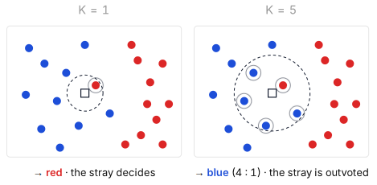
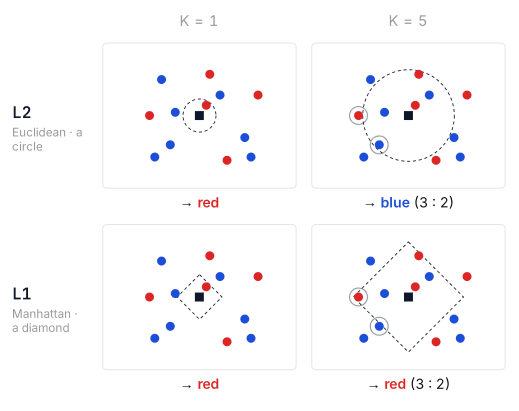

# Block 1: Introduction to Image Classification

## A Core Task in Computer Vision

Input is a imgae, output a label. The problem: Semantic gap

::: {.callout-note}

No obvious way to hard-code an algorithm for recognizing classes.

:::

### Challenges

- illumination
- Scale variation
- deforming
- Background clutter
- intraclass variation
- occlusion

### Data-driven approach

1. Collect a dataset of images and labels
2. Use machine learning to train a classifier
3. Evaluate the classifier on new images

#### Notation

- $x$ = input
- $y$ = ground truth
- $\hat{y}$ = predition
- $X, y$ = the whole dataset
- $(x_N, y_N)$ = training set
- $W_x$ = Bias. Shortcut for $W_x + b$

## Tensors

A tensor is a mathematical object that generalizes scalars, vectors, and matrices to higher dimensions. In computer science, deep learning frameworks (like TensorFlow and PyTorch) treat tensors as multi-dimensional arrays of numerical values. The number of indices needed to locate a single element defines the tensor's rank (or order/dimension).


```{=python}
import numpy as np

s = np.array(128) # scalar
v = np.array([58, 107, 154]) # vector
m = np.array( # matrix
    [[58, 107],
    [74, 128]]
    )
t = np.zeros((32, 32, 3)) # 3D-tensor: one image
b = np.zeros((50000, 32, 32, 3)) # 4D-tensor
```

### Encoding Methods

#### 1. Integer Label
* **Representation:** `y = 3`
* **Description:** Compact. But the numbers suggest an order between classes that isn't there — **indices are names, not quantities**.

#### 2. One-Hot Encoding
* **Representation:** `(0, 0, 0, 1, 0, 0, 0, 0, 0, 0)`
* **Description:** Ten slots, a single 1 at index 3 — **no false order**, and it reads as a **probability distribution**.

### Falltering

Flattening is the process of converting a multi-dimensional tensor (e.g., Rank-2, Rank-3, Rank-4) into a 1D vector (Rank-1 tensor) while preserving the total number of elements.

$$
\begin{bmatrix} 1 & 2 & 3 \\ 4 & 5 & 6 \end{bmatrix} \xrightarrow{\text{Flatten}} \begin{bmatrix} 1 & 2 & 3 & 4 & 5 & 6 \end{bmatrix}
$$

## Nearest Neighbour

### What does “Similar” mean?

#### L1 Manhattan

$$
d_1(A, B) = \sum_i |A_1 - B_1|
$$

#### L2 Euclidean

$$
d_2(A, B) = \sqrt{\sum_i (1_i - B_i)^2}
$$

### Nearest Neighbour Classifier


```{=python}
import numpy as np

class NearestNeighbour:

    def train(self, X, y):
        self.X_train = X
        self.y_train = y

    def predict(self, X):
        num_test = X.shape[0]
        y_pred = np.zeros(num_test, dtype=self.y_train.dtype)
        for i in range(num_test):
            distances = np.sum(np.abs(self.X_train - X[i,:]), axis=1)
            min_index = np.argmin(distances)
            y_pred[i] = self.y_train[min_index]
        return y_pred
```

### K-Nearest Neighbors (K-NN) Classifier

The K-Nearest Neighbors (KNN) algorithm is a simple, non-parametric, instance-based supervised learning algorithm used for both classification and regression.

#### Choosing the Parameter $K$

* **Small $K$ (e.g., $K = 1$):**
  * Highly sensitive to noise and outliers.
  * Prone to **overfitting**.
* **Large $K$:**
  * Creates smoother decision boundaries.
  * May blur class distinctions if $K$ is set too high (**underfitting**).



## Hyperparameters

For a KNN Classifier, we have 2 Hyperparameters: k and distance metric (L1 or L2).



### Data Spliting

- Train: Fit the model. For kNN: the memorized examples.
- Validation: Compare hyperparameter settings — k, distance metric — and pick the best.
- Test: One final, untouched estimate of real-world accuracy — used once.

## The Linear Classifier

### Algebraic

The whole image vector is projected onto ten numbers, one score per class. A transformation from pixel space to class scores.

$$
f(x, W) = Wx+b
$$

> Note: $Wx + b$ is a dot product per class.


```{=pyhton}
image = np.array([[58, 107], [74, 128]])
x = image.flatten() # shape (4,)
W = np.array(
    [
        [1.5, 1.3, 2.1, 0.0], # cat
        [0.2, -0.5, 0.1, 2.0], # dog
        [0.0, 0.25, 0.2, -0.3] # ship
    ]
)

b = np.array([3.2, 1.1, -1.2])
scores = W @ x + b # [384.7, 222.6, 1.95]
pred = np.argmax(scores) # 0 → cat
```

### Visual

One template per class. Each row of W is an image the class is compared against. The class score is calculated via a pixel-by-pixel match (dot product) between the input image and the class template. Limitation: A linear classifier is forced to represent an entire class using only one single template.

### Geometric

* **One Classifier, Three Viewpoints**: A linear classifier can be viewed algebraically (matrix multiplication), visually (class templates), or geometrically (hyperplanes slicing space).

* **Boundaries & Ties**: Decision boundaries occur where class scores tie ($s_{cat} = s_{dog}$), creating straight lines where bias shifts the boundary and weights turn it.

* **Hyperplanes Cutting Up Space**: The highest score wins, partitioning high-dimensional space into distinct, straight-edged regions for each class.

### Parametric vs. Non-Parametric (KNN vs. Linear Classifier)

| Feature | KNN (Non-Parametric) | Linear Classifier (Parametric) |
| :--- | :--- | :--- |
| **Storage** | Retains all 50,000 training images (~150 million numbers)[cite: 2] | Stores learned parameters ($W$ and $b$) — 30,730 numbers[cite: 2] |
| **Prediction** | 50,000 distance computations per image[cite: 2] | Single matrix multiplication[cite: 2] |
| **Training** | None (the dataset *is* the model)[cite: 2] | Learns weights ($W$) and bias ($b$) from training data[cite: 2] |
| **Post-Training** | Must retain full training dataset[cite: 2] | Training set can be safely discarded[cite: 2] |
| **Model Type** | Non-parametric[cite: 2] | Parametric (knowledge condensed into fixed parameters)[cite: 2] |