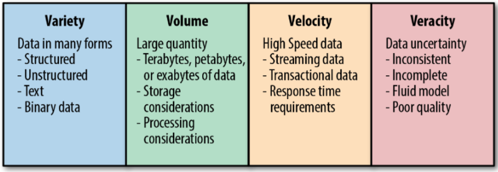
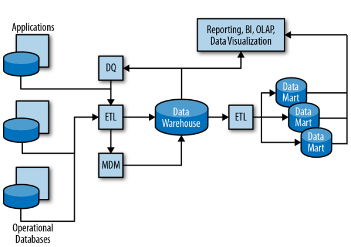
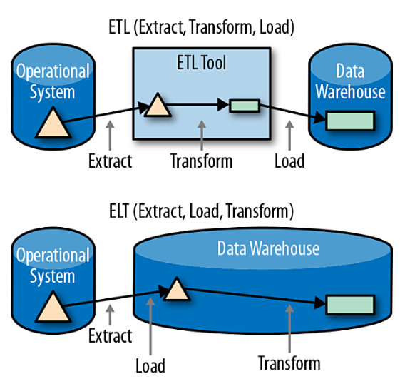
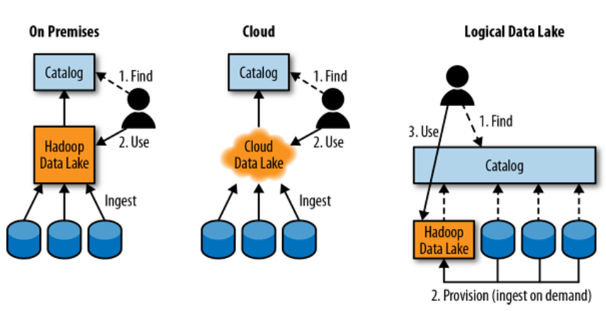

# Lecture 02: Data Lake Systems

## Big Picture

### The 4 V's of Big Data

### Data Engineering

1. Raw materials need to be brought to the job site (into the Data Lake)

2. Materials need to be cut and transformed for purpose and stored (pipelines to data sinks)

3. The actual building is the new insight or ML model, etc.

4. The supervisor directs all aspects and teams on the project (workflow orchestration)

## What is a Data lake

::: {.callout}

A Data Lake is a collection of storage instances of various data assets additional to the originating data sources. These assets are stored in a near-exact, or even exact, copy of the source format.

:::

### Features of Data Lakes

- Repository of information.
- Differs form Data Warehouses in architecture
- Cloud DL are a vital component of a modern data management strategy.
- Have the ability to store, transform, and analyze any data type.
- Allows scalability with no restrictions.
- Allows to store data without having to think of its structure.
- Allows you to dive anywhere into the vast data collected to generate insight

## Why Data Lakes

### Key Drivers for Adopting a Data Lake

* **Schema-on-Read Flexibility:** Traditional data warehouses require data to be formatted and structured before storage (*schema-on-write*). Data lakes store raw data in its native format—whether it's JSON logs, CSVs, audio, or video—and define the structure only when the data is queried (*schema-on-read*).
* **Cost Efficiency at Scale:** Built on low-cost cloud object storage (e.g., AWS S3, Azure Blob, Google Cloud Storage) or HDFS, data lakes separate compute from storage, allowing organizations to retain petabytes of raw historical data without exponential infrastructure costs.
* **Support for Advanced Analytics & AI:** Because data is kept in its original raw state, it serves as the ideal training ground for machine learning, deep learning, and predictive analytics models that require granular, un-aggregated inputs.
* **Elimination of Data Silos:** By centralizing enterprise-wide data from diverse operational systems, marketing tools, and IoT devices into a single location, organizations create a unified source of truth for cross-functional analysis.
* **Broad Query & Tool Integration:** Data lakes support simultaneous access from a variety of engines—SQL engines (e.g., Trino, Athena), batch processing frameworks (e.g., Apache Spark), and real-time streaming tools (e.g., Apache Flink).

### Data Lake vs. Data Warehouse

| Feature | Data Lake | Data Warehouse |
| :--- | :--- | :--- |
| **Data Format** | Raw (Structured, Semi-structured, Unstructured) | Processed & Structured (Relational) |
| **Schema Model** | Schema-on-Read | Schema-on-Write |
| **Primary Users** | Data Scientists, ML Engineers, Data Engineers | Business Analysts, BI Developers, Executives |
| **Primary Use Cases** | Machine Learning, Big Data Analytics, IoT Processing | Operational Reporting, Standard BI Dashboards |
| **Cost** | Low cost for high-volume storage | Higher cost per gigabyte |

#### Data Flow in the Data Warehousing Ecosystem

#### ETL vs. ELT

## External Data

### Challenges

- Data quality
- Licensing costs
- Intellectual property
- Consistency Risks: Dame data set cleansed differently
- Duplicate: No single source of truth

## Cross-Industry Standard Process for Data Mining (CRISP-DM)

Introduced in 1996, it remains the most widely used open-standard methodology for guiding data science, machine learning, and data mining projects from concept to production.

1. **Business Understanding**: Define business objectives, success metrics, and project goals.

2. **Data Understanding**: Collect, explore, and identify quality issues in raw data.

3. **Data Preparation**: Clean, format, merge, and engineer features (takes ~70-80% of project time).

4. **Modeling**: Select, train, and tune algorithmic models.

5. **Evaluation**: Assess model results against original business goals before deployment.

6. **Deployment**: Integrate models into production systems with ongoing monitoring.

## Data Lake Architecture

### Core Architecture Stages

1. **Ingestion Layer**
   * **Functions:** Captures scalable streaming and batch data, applying business logic, validation, data quality checks, and routing.
   * **Tech Stack:** Apache Flume, Apache Kafka, Apache Storm, Apache Sqoop, NFS Gateway.

2. **Storage / Retention Layer**
   * **Functions:** Stores data in various formats (Hadoop HDFS, Hive, HBase, Elasticsearch, or in-memory) depending on requirements; manages metadata and policy-based retention.
   * **Tech Stack:** HDFS, Hive Tables, HBase/MapR DB, Elasticsearch.

3. **Processing Layer**
   * **Functions:** Handles batch and near-real-time data processing, provides workflows for repeatable jobs, and handles late-arriving data.
   * **Tech Stack:** MapReduce, Hive, Spark, Storm, Drill.

4. **Access Layer**
   * **Functions:** Delivers business insights via visualization dashboards and serves data to downstream consumers through APIs, message queues, and DB connections.
   * **Tech Stack:** Visualization tools (Qlik, Tableau, Spotfire), REST APIs, Apache Kafka, JDBC.

::: {.callout-important}

Don’t turn your Data Lake in to a data Swamp. Data Lakes can and should reach a high level of organisation and catalog with the help of databased.

:::

### Management & Governance
Underpinning all four layers are overarching management, monitoring, and governance capabilities powered by enterprise platform tools like **Ambari**, **Cloudera Manager**, **Cloudera Navigator**, and **MapR MCS**.

### Different Data Lake Architectures

## Data Lake Issues

* **Risk of "Data Swamps":** Without governance measures like detailed metadata tracking, data lakes easily devolve into disorganized, unusable storage dumps.
* **Access Control & Governance Hurdles:** Broad, cross-departmental access to internal and external data makes enforcing data governance and auditing user access difficult.
* **Unclear Strategic Role:** The exact operational role—whether to replace, offload, or sit in parallel with data warehouses/marts—remains ambiguous, though dimensional modeling remains essential across all setups.
