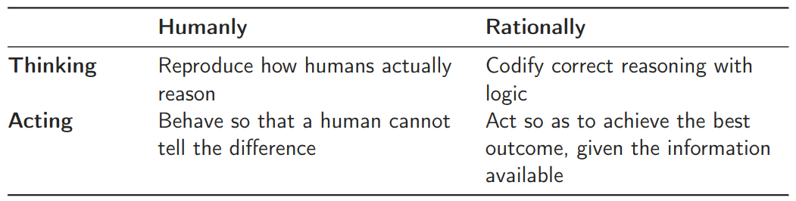
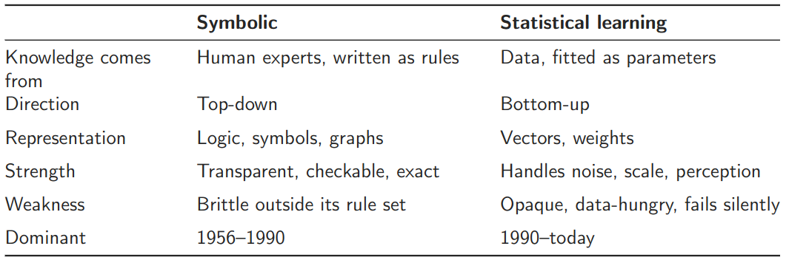
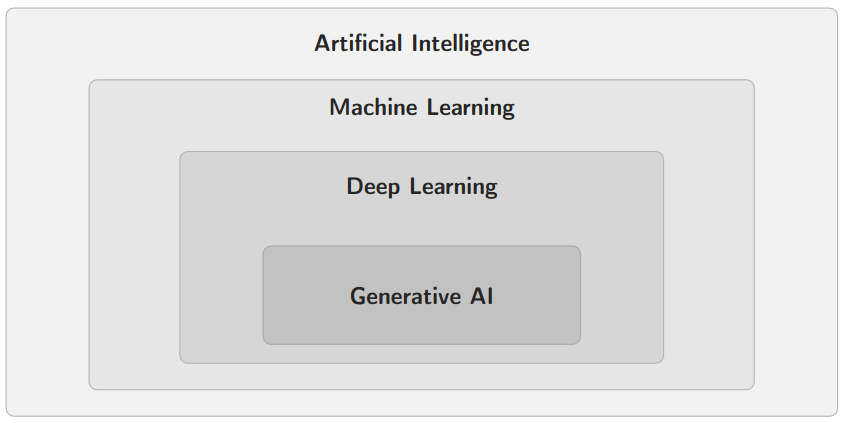
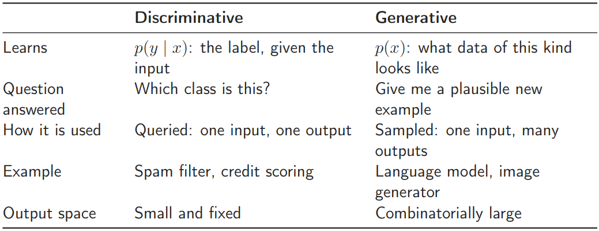
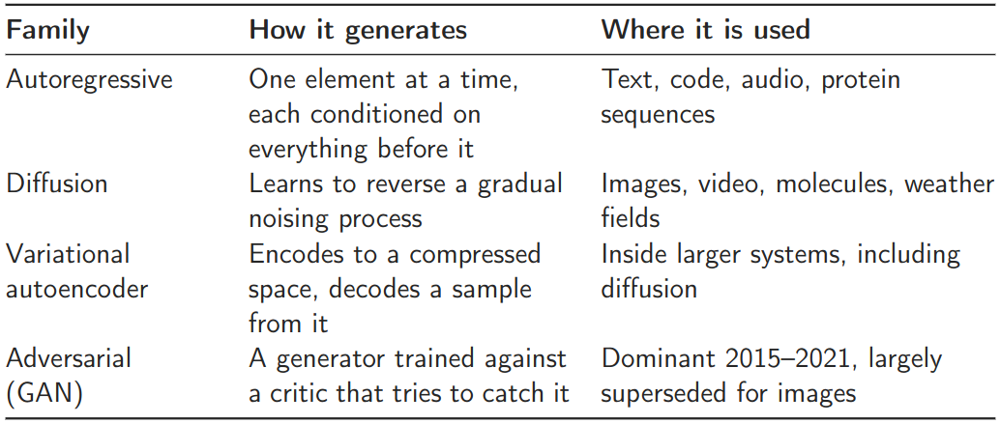
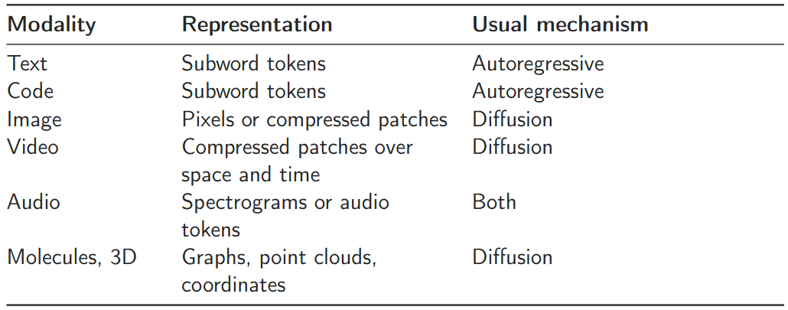
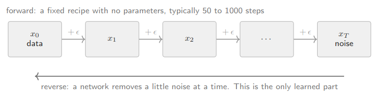
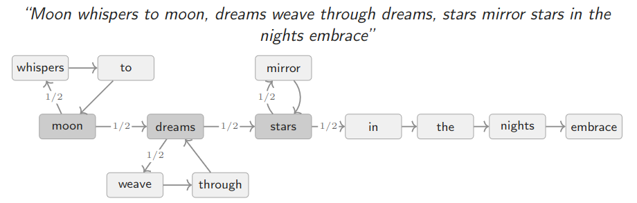
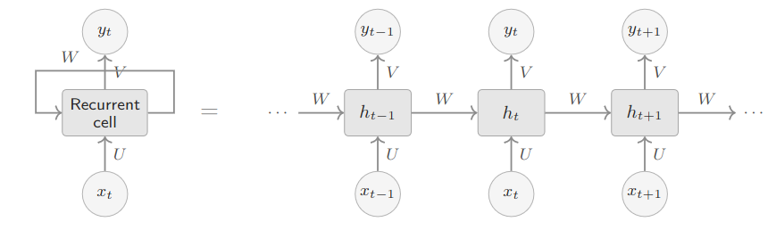
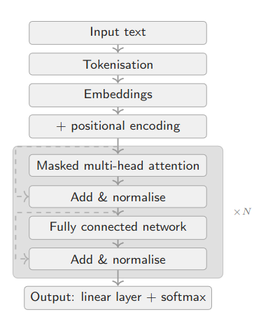

# Lecture 01: Introduction to Generative AI

## What is AI?

Artificial Intelligence is the study and construction of systems that perform tasks which, when performed by humans, we describe as requiring intelligence.

> Note: There is no single accepted definition.

Two properties of this definition matter more than the definition itself:

- It is defined by task, not by mechanism. Nothing is said about how the system works inside.
- It is a moving target. Route planning, spell checking and speech transcription were all called AI until they worked reliably, after which they quietly became software.



### Tradition vs. Statistical Learning



### GenAI in the World of Data Science



## History of AI

### AI Winter

An AI Winter is a period of sharply reduced funding, interest, and commercial development in artificial intelligence, typically triggered by overhyped expectations followed by disappointing real-world results.

1. Demonstrations generalise badly: A demo shows the best case on chosen inputs. Deployment cost is dominated by the worst case, and nobody demos that.
2. The last ten percent is most of the work: Expert systems did not fail on accuracy. They failed on maintenance, because the rules had to be kept current by the experts who wrote them.
3. Capability and value are different variables: Both winters arrived while the technology was still improving. Improvement is not adoption, and adoption is not profit.

## What is GenAI?

### Discriminative and Generative Models



A model that has learned $p(x)$ can be used discriminatively. The reverse does not work. That asymmetry is why one pretrained language model handles classification, extraction, translation and summarisation, where the previous generation needed a separate trained model for each.

### What a Language Model really is

Strip away the interface and a language model does exactly one thing: given some text, it produces a probability for every possible next piece of text. Three consequences follow directly. Almost every complaint about these systems is one
of them, wearing a different hat:

- The output is a sample, so the same prompt legitimately gives different answers on different runs.
- The model is fitted to what is likely, not to what is true. A plausible citation and a real one look identical from the inside.
- Whatever was rare or absent in the data is rare or absent in the model, however confidently it is described.

### Families of generative models



#### Modalities




::: {.callout-note}

A multimodal model pushes several of these into one shared space, so a picture and a sentence describing it land close together. Once they do, either can condition the generation of the other. That is the whole basis of text-to-image.

:::

## Where is GenAI

- Software engineering: Code completion, test generation, migration, review.
- Customer service: First-line response drafting, ticket routing, call summarisation.
- Marketing and sales: Copy variants, personalisation, lead research, CRM notes.
- Finance and controlling: Report drafting, variance commentary, document extraction.
- Legal and compliance: Contract review against a playbook, clause extraction.
- Human resources: Job descriptions, screening support, policy question answering.
- Research and development: Literature search, hypothesis generation, simulation surrogates.

Depending on the field, GenAI can be deploy as an assistant, embedded feature or agent.

## Introduction to LLMs

The probability of a whole text splits exactly into a product of one-step predictions:

$$
p(x_1, x_2, \dots, x_T) = \prod_{t=1}^{T} p(x_t \mid x_1 \dots x_{t-1})
$$

Read it right to left: the probability of the whole is the probability of each piece given everything before it. The split is exact, so all of the modelling sits in that one conditional, and that conditional is what the network computes.


::: {.callout-note}

Two things follow, and both are load-bearing:

- The label is free. The right answer is just the next word in the text, so nobody has to annotate anything. This is what makes training on the whole web possible.
- Everything else is a side effect. Grammar, world knowledge, translation and arithmetic were never trained for. They are what it takes to predict text well.

:::

### Tokenisation

Text is cut into subword pieces, each with an integer id. The vocabulary is learned from the corpus: frequent strings survive whole, rare ones get split.

Three consequences you will meet using these systems:

- Arithmetic is unreliable, partly because a number has no stable representation.
- Counting letters or reversing a word is hard, for the same reason.
- Some languages need more pieces per word than English, so the same sentence costs more to process. Multilingual products pay a tax nobody budgets for.

### Embeddings

Each token identifier is replaced by a vector of a few thousand numbers, learned along with everything else. Tokens that appear in similar contexts end up near each other.

- Similarity becomes geometry: distance in this space is a usable measure of relatedness, which no dictionary lookup gives you.
- Position in the sentence is added separately. Without it, the machinery that follows would treat a sentence as an unordered bag of words.
- The same vectors, taken from an intermediate layer, are what search systems index.

> Note: Semantic search over your own documents is a nearest-neighbour query in this space

### Self-attention

Self-attention is a mechanism in deep learning that allows a model to weigh the importance of different tokens in a sequence relative to each other, regardless of their position.Instead of processing data sequentially (like traditional RNNs), it evaluates the entire input at once to capture long-range dependencies and context. For each input token, the model creates three vectors:

- Query ($Q$): What the token is looking for.
- Key ($K$): What the token contains/offers.
- Value ($V$): The actual representation of the token to pass along.

The model computes dot products of the Query with all Keys to determine relevance scores, applies a Softmax function to turn scores into probabilities (weights), and multiplies these weights by the Values.

$$
\text{Attention}(Q, K, V) = \text{softmax}\left(\frac{QK^T}{\sqrt{d_k}}\right)V
$$

> Note: Multi-head attention runs several of these side by side with separate projections, so different heads can follow different relations at once.

#### Properties of Attention

1. It is parallel: Every position is computed at the same time. A recurrent network has to finish word t before it can start word t + 1; a transformer does not. This is why the architecture can absorb a whole GPU cluster.
2. It is quadratic: Every position is compared with every other, so the score matrix
has $T^2$ entries. (e.g. 1000 tokens have 1 attention cost).

### Transformer Block

A decoder-only Transformer block processes text through two main stages wrapped in stability controls:

1. RMSNorm (Pre-Normalization): Normalizes token vectors before each stage to keep training and signal flow stable across deep layers.

2. Causal Self-Attention (Token Communication): Allows tokens to look back at previous words to gather context using Query, Key, and Value projections. Causal masking blocks future tokens, while RoPE injects positional information.

3. Residual Connection: Adds the pre-attention input back into the attention output ($x+\text{Attention}(x)$) to prevent signal loss.

4. Feed-Forward Network / FFN (Token Computation): Processes each token independently through expanded non-linear layers (e.g., SwiGLU) to recall facts and perform reasoning.

5. Residual Connection: Adds the pre-FFN input back into the final output.

### Pretrained model

A pretrained model continues text. It does not follow instructions. Three stages close
the gap. Finetuning and preference tunding use a small fraction of the data and compute, yet change observed
behaviour more than anything else: capability from stage one, usability from the rest.

#### Add unknown Information to a Model

1. Add it to the prompt

2. Retrieval (RAG)

3. Fine-tuning

> Note: Tine-tuning teaches form, not facts.

### Decoding

The model gives a probability for every possible next token. How you pick from that list
is a design choice with visible consequences.

- Greedy: Always take the most likely token.

- Temperature: Sharps the distribution.

- Top-$p$: Sample from the most likely tokens covering $p$ of the mass.

### Limitation of LLMs

- Fabrication: The objective rewards likely continuations, and a plausible
reference is a likely continuation.

- Overconfidence: Fluency is identical whether the model is right or wrong, so
the surface carries no signal.

- Asymmetric knowledge: A model trained on “A is B” does not reliably answer about “B is A”. Facts are stored by context, not as relations.

- Arithmetic: Digits are tokenised inconsistently and there is no carry mechanism. Delegate to a tool.

- Stale knowledge Weights are frozen at training time. Anything later has to arrive through the prompt.

- Prompt injection Instructions and data share one channel, so text hidden in a retrieved document can redirect the model. Unsolved, and the main security concern for agents.

## Diffusion Models

Adding noise to an image takes one line of code and no learning at all. Creating an image is hard. Diffusion models exploit that asymmetry: define an easy process that destroys the data, then learn to reverse a single step of it.



Generation runs right to left. You start from pure noise and walk back, and what comes
out was never in the training set.

### Training

The training loop has four steps, none of which needs a human:

1. Take a training image $x_0$.

2. Pick a random noise level $t$.

3. Add exactly that much noise $ϵ$ to get $x_t$. We know what we added.

4. Show $x_t$ to the network and ask it to name the noise.

Since we generated $ϵ$ ourselves, the correct answer is free. Train by minimising the gap
between guess and truth

$$
\text{loss} = \left\| \epsilon - \epsilon_\theta(x_t, t) \right\|^2
$$

### From Noise to Picture

#### Conditioning
The prompt is turned into an embedding and handed to the network at every denoising step, so the text steers each one. Text and images were trained into a shared space beforehand, which is what allows a sentence to point at a region of image
space.

#### Guidance
At each step the model is run twice, once with the prompt and once without, and the difference is amplified. Turning this up raises prompt adherence and lowers variety. It is the most visible knob in image generation and the reason over-guided pictures look stiff and oversaturated.

#### Working small
Running the process on full-resolution pixels is expensive. Latent diffusion runs it in a compressed space and decodes only at the end. That one change put image generation on consumer hardware, and with it the entire open ecosystem.

## GenAI in Industry

### The Gap between Productivity and Profit

- Measurement: Time saved on a task never reaches Earnings Before Interest and Taxes (EBIT) unless the freed capacity is redeployed or removed. Most firms do neither.

- Workflow: What distinguishes the six percent is redesign of end-to-end processes, not the choice of model or vendor.

- Competition: A gain available to every firm in a sector is competed into prices rather than kept as margin.

- Timing: Costs are immediate; returns lag. This is the optimistic reading, and it is the one every vendor offers.

### Cost Structure

- Marginal cost is not zero: Every call consumes tokens and therefore money. A feature used ten times more often costs ten times more to run, which inverts the usual software instinct that usage is free.

- Input and output are priced differently, and long context is priced differently again, following the quadratic cost from Part 5.

- Inference dominates the lifetime bill, not training, for anyone not building frontier models themselves.

- Caching and routing are the two levers that actually move the number: reuse repeated context, and send easy calls to a small model.

### Regulation

The EU AI Act, Regulation (EU) 2024/1689, reaches Swiss companies whenever a system is placed on the EU market or its output is used in the EU. The Digital Omnibus on AI, Regulation (EU) 2026/1744, entered into force on 27 July 2026 and moved several dates. Switzerland has no equivalent horizontal AI statute. The binding domestic constraints are the revised Data Protection Act, sector supervision such as FINMA, and copyright.

### Business Cases Risks

- Fabrication: A confident, well-formatted, wrong answer reaching a customer.
- Data leakage: Confidential input sent to a third-party endpoint under unclear terms.
- Intellectual property: Unclear rights in training data and in generated output.
- Prompt injection: Instructions hidden in a document that an agent then follows.
- Bias: Patterns in the training data reproduced in screening or scoring.
- Vendor dependence: Capability, price and behaviour controlled by an external provider.
- Evaluation debt: No test set, so no way to notice when an update broke the workflow.

## GenAI in Research

### GenAI as an Object of Reseach

- Interpretability: What computation does a trained network actually implement?
- Generalisation: Why does a model with more parameters than data not simply memorise?
- Evaluation How do you measure capability when benchmarks leak into training data?
- Calibration Can a model report its own uncertainty in a way that survives fine-tuning?
- Data limits What happens as models are trained on the output of earlier models?

# Lecture 02: Building Blocks of Generative AI$

## Markov Chains

A Markov chain is a mathematical system that models transitions from one state to another based on probabilistic rules. Its defining feature—the Markov Property—dictates that the probability of transitioning to the next state depends *only* on the current state (or a fixed history of recent states), ignoring all prior steps.

$$
p(x_t|x_{t-1})
$$

Fitting this model needs no optimiser. Count how often word b follows word $a$, and
divide:

$$
\hat{p}(b|a) = \dfrac{\#(ab)}{\#a}
$$

- The states are the words of the vocabulary.
- The model is a table of transition probabilities, one row per word.
- Generation is a random walk: look up the row of the current word, draw the next word from it, move there, repeat.

### Word Corpus example



There are 12 unique words out of the 15 total words. Therefore, the transition matrix is $12 \times 12$. Unlabeled arrows mean a probability of $1.0$ (or 100%). For instance, after `whispers`, the only word that ever followed it in the training text was `to`. Three words — `moon`, `dreams`, and `stars` — repeat in the training sentence, creating three loops. Each of these 3 nodes has two outgoing paths.


```{=python}
import random
from collections import Counter, defaultdict
words = (
    "moon whispers to moon dreams weave through dreams"
    "stars mirror stars in the nights embrace"
    ).split()
counts = defaultdict(Counter) # counts[a][b]: how often b follows a
for a, b in zip(words, words[1:]):
    counts[a][b] += 1
def generate(start, max_words):
    out = [start]
    while len(out) < max_words and counts[out[-1]]: # stop at a word with no successor
        followers = counts[out[-1]]
        out.append(random.choices(list(followers), weights=followers.values())[0])
    return " ".join(out)
```

### What one word of memory costs

Expanding the context to $n$ preceding words requires a lookup table with **$V^{n+1}$ entries** for a vocabulary size of $V$ words. or a realistic vocabulary size of **$V = 50,000$ words**, the number of required table entries explodes exponentially.

| Context ($n$ Previous Words) | Formula ($V^{n+1}$) | Total Entries in Lookup Table |
| :--- | :--- | :--- |
| **1 previous word** (Bigram) | $50,000^2$ | $2.5 \times 10^9$ (2.5 billion) |
| **2 previous words** (Trigram) | $50,000^3$ | $1.25 \times 10^{14}$ (125 trillion) |
| **3 previous words** (4-gram) | $50,000^4$ | $6.25 \times 10^{18}$ (6.25 quintillion) |

Most word combinations are never observed in training data (frequency = 0), leaving the model with no probability values for those contexts. Instead of storing a discrete probability number for every possible context, we compute predictions using a mathematical function with shared parameters across all contexts.

## Recurrent Networks

### Architectural Overview

An RNN processes sequential data by passing information across time steps through a recurring loop. A single Recurrent Cell processes input $x_t$ and passes its memory back to itself via a feedback loop.



### Core Equations

The state transitions and predictions are computed using two main equations:

1. **Hidden State Update:**
   $$h_t = \sigma(U x_t + W h_{t-1})$$

2. **Output Prediction:**
   $$y_t = f(V h_t)$$

### Key Components & Concepts

* **$x_t$ (Input):** The input vector at time step $t$.
* **$h_t$ (Hidden State):** The memory of the network. It summarizes everything learned from prior steps ($x_1 \dots x_t$).
* **Weight Matrices (Shared Parameters):**
  * **$U$:** Reads and projects the current input $x_t$.
  * **$W$:** Carries the previous hidden state $h_{t-1}$ forward to the next step.
  * **$V$:** Transforms the hidden state $h_t$ into the output $y_t$.
  > **Note:** The exact same three weight matrices ($U, W, V$) are reused at every single time step.

* **Activation Functions:**
  * **$\sigma$:** Non-linear activation function for updating the hidden state (typically $\tanh$).
  * **$f$:** Activation function for output generation (e.g., Softmax over the vocabulary for word prediction tasks).

### Limitations of RNNs

1. **Sequential Processing Bottleneck:**
   * Step $t$ depends directly on step $t-1$.
   * Words must be processed one after the other, preventing parallel training across sequence positions on modern GPUs.

2. **Vanishing and Exploding Gradients:**
   * Passing error signals back over many steps involves repeated matrix multiplication by weight $W$.
   * **Vanishing:** Early words stop influencing learning as gradients shrink toward zero.
   * **Exploding:** Gradients grow exponentially, making training unstable and causing it to diverge.

3. **Fixed-Size Vector Bottleneck:**
   * The hidden state vector has a fixed size.
   * Information from an entire sequence—whether 10 words or 1,000 words—must be compressed into this single vector.

## Transformer

### Transformer Architecture Comparison

| Feature | Encoder-only | Decoder-only | Encoder-decoder |
| :--- | :--- | :--- | :--- |
| **Examples** | BERT, RoBERTa, DistilBERT, ALBERT | GPT, GPT-2, GPT-3, GPT-4 | T5, BART, Original 2017 Transformer |
| **Context** | **Bidirectional:** Reads left and right context simultaneously | **Unidirectional:** Reads strictly left-to-right | **Hybrid:** Bidirectional for input, left-to-right for output |
| **Pretraining Task** | Masked language modeling, next-sentence prediction | **Autoregressive:** Predict the next token | Reconstruct corrupted text |
| **Typical Use** | Text classification, named-entity recognition, question answering over text | Writing, summarization, dialogue, answering open-ended questions | Machine translation, text summarization |
| **Generates Text** | **No** (does not require a decoder) | **Yes** (token by token, no separate encoding step) | **Yes** |


::: {.callout-note}

* **Encoder-only** models excel at understanding and analyzing existing text.
* **Decoder-only** models (like the GPT family) serve as the foundation for modern generative AI chat assistants by predicting text token by token.
* **Encoder-decoder** models bridge both approaches, making them well-suited for translation and sequence transformation tasks.

:::

## GPT Decoder

### Pipeline



* **Input:** The raw sequence to be extended, e.g., the start of a sentence
* **Tokenisation:** Splits the input into tokens: words, subwords, or characters
* **Embedding:** Maps each token to a dense vector
* **Positional encoding:** Injects the position of each token in the sequence
* **Masked self-attention:** Computes attention scores between tokens, with future tokens masked out
* **Feed-forward layers:** A small neural network applied to each token after attention
* **Output layer:** A linear layer followed by a softmax over the vocabulary

#### Tokenisation

- Word-level is simple, but the vocabulary is huge and an unseen word has no token.
- Subword balances the two, and is what GPT and BERT use. Lecture 1 showed what it does to arithmetic and to German.
- Character-level never meets an unseen word, but sequences get long, and attention cost grows with the square of the length.


```{=pyhton}
import tiktoken

encoding = tiktoken.get_encoding("cl100k_base")
print(encoding.encode("Natural language processing is fascinating!"))
```

> Note: The model never sees a letter.

#### Embeddings

* **Input:** The token sequence from the previous stage
* **Lookup table:** A matrix $E$ with one row per token in the vocabulary
* **Lookup operation:** Token $i$ selects row $i$ of $E$
* **Output:** A sequence of dense vectors, one per token

##### Learning Embeddings

| Feature | Skip-gram | CBOW (Continuous Bag of Words) |
| :--- | :--- | :--- |
| **Goal** | Predict the surrounding words from a target word | Predict a target word from its surrounding words |
| **Training Input** | One target word | The context words |
| **Training Output** | The context words | The target word |
| **Rare Words** | Handles them better | May struggle |
| **Training Speed** | Slower | Faster |

#### Self-attention

An embedding is the same vector wherever the token appears. *Bank* by a river and *bank* with a loan desk enter the network identically. Something has to mix in the context, and self-attention is that something.

For every input token vector, self-attention creates three distinct vectors by multiplying the token embedding by three learned projection matrices ($W_Q, W_K, W_V$):

* **Query ($Q$):** Represents what the current token is looking for.
* **Key ($K$):** Represents what information the token contains (used for matching with queries).
* **Value ($V$):** Contains the actual contextual content/representation of the token.

The standard scaled dot-product attention is calculated using the following formula:

$$
\text{Attention}(Q, K, V) = \text{softmax}\left(\frac{Q K^T}{\sqrt{d_k}}\right) V
$$

1. **Dot Product Similarity ($QK^T$):** Computes raw similarity scores between every Query vector and all Key vectors in the sequence.
2. **Scaling ($\sqrt{d_k}$):** Divides by the square root of the Key dimension size ($d_k$) to prevent extreme gradient values during training.
3. **Softmax Normalization:** Converts scores into probabilities (weights) that sum to 1 across the sequence.
4. **Weighted Value Combination ($V$):** Multiplies the softmax attention weights by the Value vectors to form the final contextual representation for each token.

#### The feed-forward Network

* **Purpose:** Adds non-linearity and processes the output of attention further
* **Structure:** Two fully connected layers with a non-linear activation (e.g., ReLU) between
* **Input:** The output of attention: one context vector per token
* **Output:** A vector of the same size, in a space where prediction is easier

$$
text{FFN}(x) = W_2 \sigma(W_1 x + b_1) + b_2
$$

* **$x$:** Input context vector from the attention layer
* **$W_1, W_2$:** Weight matrices for the linear transformations
* **$b_1, b_2$:** Bias vectors
* **$\sigma$:** Non-linear activation function (such as ReLU, GELU, or SwiGLU)


::: {.callout-note}

Layer normalisation rescales each token vector to zero mean and unit variance, which keeps activations in range from block to block.

:::

## Assesing Quality

| Metric | Main Idea | Direction |
| :--- | :--- | :--- |
| **Perplexity** | Measures how well the model predicts a given text | Lower is better |
| **BLEU** | Evaluates $n$-gram overlap between model output and reference translations | Higher is better |
| **ROUGE** | Measures token overlap with references, with variants that emphasize recall | Higher is better |
| **METEOR** | Measures text overlap while also accounting for synonyms, word stems, and word order | Higher is better |
| **BERTScore** | Computes similarity based on contextual BERT embeddings instead of surface strings | Higher is better |
| **Human evaluation** | Human judges rate generated text for fluency, coherence, and relevance | Higher is better |

### Perplexity

Perplexity (PPL) is a fundamental evaluation metric in natural language processing (NLP) and language modeling. It measures how effectively a model predicts a given text sequence. Perplexity is calculated as the exponential of the average negative log-likelihood (or cross-entropy loss $H$) over a sequence of $N$ tokens $W = (w_1, w_2, \dots, w_N)$:

$$
\text{PPL}(W) = \exp\left( -\frac{1}{N} \sum_{i=1}^{N} \log P(x_i \mid x_1, \dots, x_{i-1}) \right)
$$
