# Session 1: Data Management 

## What is a Database

A database is an organized and structured set of records stored and managed for a common purpose. A data record is an information element which, as a unit, describes a complex set of facts.

## Architecture and Components of an Information System

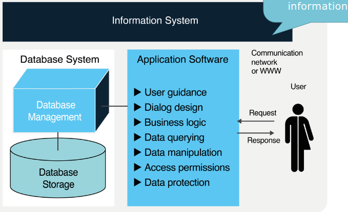

## File System

A file system is a structured method used by an operating system to organize, store, and retrieve data on a storage drive. It manages how data is named, placed, and grouped into files and directories, acting as a bridge between the raw hardware and the user.

## Why do we use databases?

- Enable multi-user operations: Manage transactions
- Query and manipulate data sets
- Ensure data consistency and integrity automatically
- Retrieve large data quantities (indexing, parallelization) efficiently

## Big Data Challenges

Big data primarily refers to data sets that are too large or complex to be dealt with by traditional data-processing software. Data with many entries (rows) offers greater statistical power, while data with higher complexity (more attributes or columns) may lead to a higher false discovery rate.

- **Volume**: This refers to the sheer amount of data generated every second, requiring massive storage capacities that go far beyond traditional hardware.
- **Velocity**: This represents the incredible speed at which data is created, processed, and analyzed, often in real-time or near real-time.
- **Variety**: This describes the diverse types of data available, ranging from structured text in databases to unstructured formats like video, images, and social media posts.
- **Veracity**: This focuses on the quality, accuracy, and trustworthiness of the data, as "messy" data can lead to incorrect conclusions.
- **Value**: This is the most critical V, referring to the ability to turn bulk data into meaningful insights that drive business decisions or solve problems.

## NoSQL Databases

Optimization for Big Data:

- Non-relational data structures
- Non-relational database languages

## Data Management 

Data Management comprises all methods related to creating value from data as a resource.

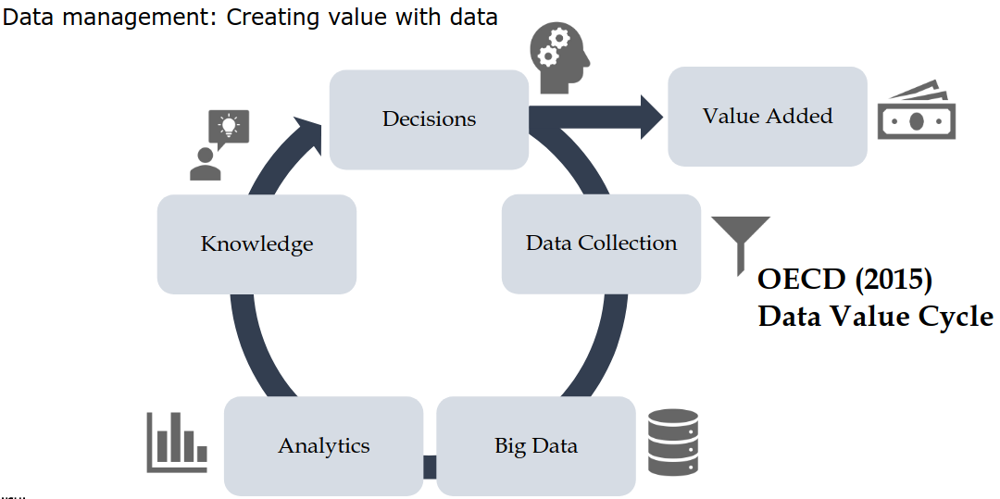

### Database Application

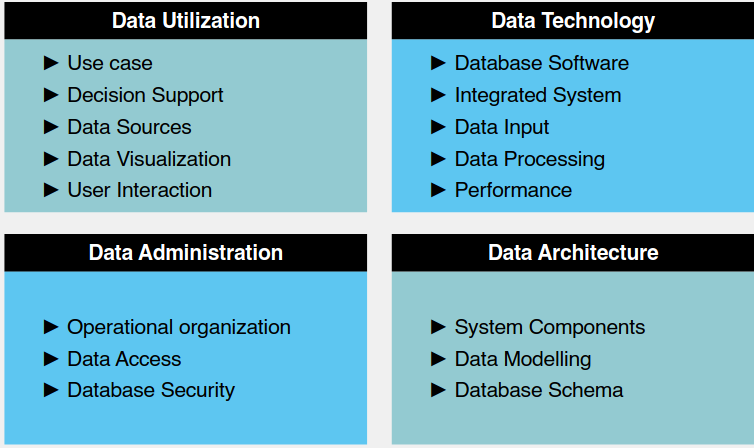

# Session 2: Database Modeling

## Database Modeling

### Requirements Analysis

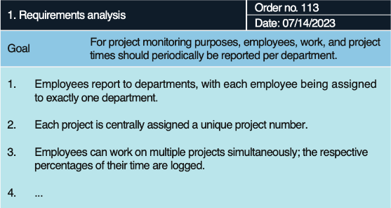

### Conceptual Modeling

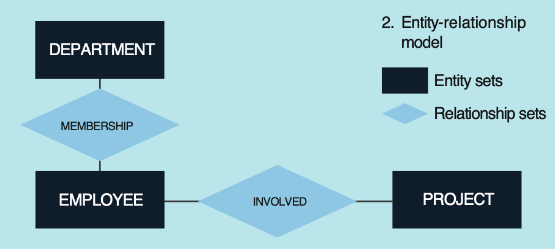

### Database Shema

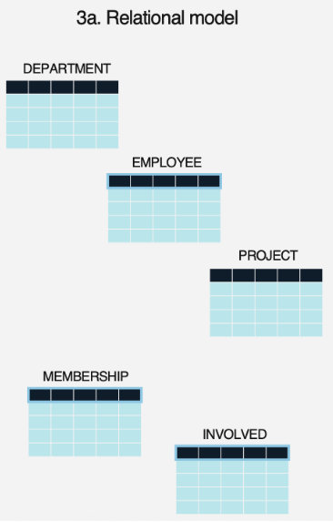

## Table Defintion

A table or relation refers to a set of tuples (set of ordered, immutable objects) shown as a table.

- Table name: A table has a unambiguous name.
- Attribute name: Is unambiguous; denotes a specific column with the desired attribute.
- No column order: The attribute number is unlimited; the column order has no meaning.
- No row order: The tuple number in a table is arbitrary; the tuple order has no meaning.
- Identification key: One of the attributes or combination thereof unambiguously identifies the tuples in the table and is called the identification key

### Entities

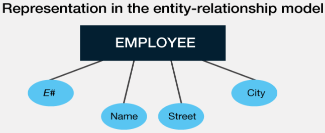

### Relationships

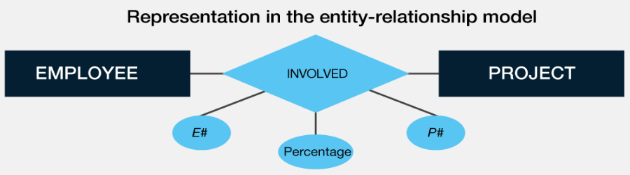

### The Entity Relationship Model

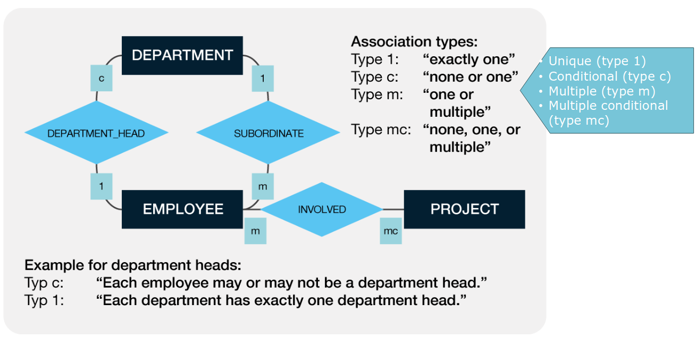

## Redundancy and Normal Forms in Tables

Redundancy in tables can lead to anomalies in databases. An attribute is redundant if individual values of it can be omitted without any loss of
information. Normal forms serve to avoid redundancy.

> Note: Anomalies = Insertion anomaly, mutation anomaly, deletion anomaly.

## Normal Forms

| Stage | Key Focus | Goal |
| :--- | :--- | :--- |
| **1NF** | Atomicity | Eliminate duplicate columns and multi-valued cells. |
| **2NF** | Full Dependency | Eliminate partial dependencies on the primary key. |
| **3NF** | Direct Dependency | Eliminate dependencies between non-key columns. |
| **4NF** | Multi-valued facts | Isolate independent multi-valued relationships. |
| **5NF** | Reconstruction | Minimize redundancy in complex many-to-many relationships. |

# Session 3: Database Integration

## SQL Data Manipulation Lanugage

- `CREATE TABLE`: Define tables
- `DROP TABLE`: Delete tables
- `ALTER TABLE`: Change table definition
- `INSERT`: Insert data


```sql
INSERT INTO Employee VALUES
('E22', 'Cole', '7th Street', 'Manhattan', 'A6'),
('E23', 'Smith', 'Reseda Blvd', 'Los Angeles', 'A5')
```

- `UPDATE`: Changing the data
- `SELECT`: Filter data
- `DELETE`: Delete data

## Data Base Integration

Database Integration not only helps automate Data Preparation. Metadata and schema integration also contributes to data understanding.

## ETL (Extract, Transform, Load)

In the traditional ETL process, data is transformed on a secondary staging server before it ever reaches the target database (usually a Data Warehouse).

> Note: Best for structured data, small-to-medium data volumes, and legacy on-premise systems.


```sql
LOAD DATA LOCAL INFILE '/path/to/ratings.csv'
INTO TABLE Ratings
FIELDS TERMINATED BY ','
ENCLOSED BY '"'
IGNORE 1 LINES
(UserID, MovieID, Rating, @Timestamp)
SET Timestamp = FROM_UNIXTIME(@Timestamp);
```

### Loading large Datasets

By Table Import Utility in the MySQL Shell.

## ELT (Extract, Load, Transform)

ELT is a modern evolution where data is loaded into the target system (usually a Cloud Data Warehouse or Data Lake) in its raw form. The transformation happens within the target system using its own processing power.

> Note: Best for unstructured/Big Data, high velocity, and modern cloud environments (like Snowflake, BigQuery, or Redshift).

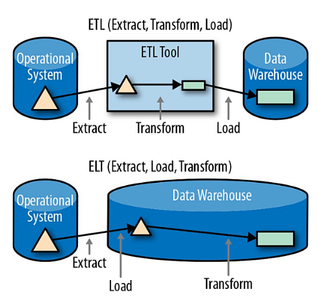

# Session 5: SQL Language Concepts

## Data Definition Language (DDL)

### Tabels


```sql
CREATE TABLE person (
    PersonId INTEGER,
    Name VARCHAR(100),
    Birthdate DATE);
```

::: {.callout-tip}

Always use semicolon to terminate SQL statements

:::

#### Data Types

| Data Type | Category | Description | Typical Use Case |
| :--- | :--- | :--- | :--- |
| **`INT`** | Numeric | A standard integer (4 bytes). Range is -2,147,483,648 to 2,147,483,647 (or 0 to 4,294,967,295 if `UNSIGNED`). | Primary keys, user IDs, quantities. |
| **`BIGINT`** | Numeric | A large integer (8 bytes). Used when values might exceed the `INT` range. | High-traffic IDs, auto-incrementing logs, financial transactions. |
| **`DECIMAL(p,s)`** | Numeric | Fixed-point number where `p` is total precision (digits) and `s` is scale (decimals). Exact, no rounding errors. | Currency, exact measurements, financial data (e.g., `DECIMAL(10,2)`). |
| **`FLOAT` / `DOUBLE`**| Numeric | Floating-point numbers for approximate values. `DOUBLE` has higher precision than `FLOAT`. | Scientific calculations, GPS coordinates where slight rounding is okay. |
| **`VARCHAR(M)`** | String | Variable-length string. `M` defines the maximum character length (up to 65,535). Efficient for varying lengths. | Names, email addresses, passwords, titles. |
| **`CHAR(M)`** | String | Fixed-length string. Right-padded with spaces to specified length `M` (up to 255). Faster than VARCHAR for fixed data. | Country codes (US, CA), MD5 hashes, state abbreviations. |
| **`TEXT`** | String | Long-form text data (up to 65,535 characters). Cannot have a default value. | Blog post bodies, product descriptions, comments. |
| **`DATE`** | Date/Time | Date value in `YYYY-MM-DD` format. Range: 1001-01-01 to 9999-12-31. | Birthdays, hiring dates, expiration dates. |
| **`DATETIME`** | Date/Time | Date and time combination in `YYYY-MM-DD HH:MM:SS` format. Supported range is 1000-01-01 to 9999-12-31. | Event schedules, booking times. |
| **`TIMESTAMP`** | Date/Time | Date and time combination, stored as UTC seconds since epoch. Range: 1970-01-01 to 2038-01-19. Automatically updates. | "Created at" or "Updated at" record tracking. |
| **`BOOLEAN`** | Numeric | Synonym for `TINYINT(1)`. Zero is considered false, non-zero values are true. | Flags like `is_active`, `has_paid`, `is_admin`. |
| **`JSON`** | Document | Stores RFC-compliant JSON documents. Enables native schema-less data validation and quick lookups. | User preferences, dynamic form data, third-party API responses. |

> Note: MySQL data types.

### Primary-/Foreign-Keys


```sql
CREATE TABLE course (
    CourseId INTEGER NOT NULL,
    CourseNo VARCHAR(20),
    ProfessorPersonId INTEGER,
    CONSTRAINT PK_Course
    PRIMARY KEY (CourseId),
    CONSTRAINT FK_Course_Person
    FOREIGN KEY (ProfessorPersonId)
    REFERENCES Person (PersonId)
    );
```

Surrogate keys are often numbers. DBMS supports you to automatically generate these numbers by using `AUTO_INCREMENT (as Primary Key)`. This command automatically
creates a numeric value.

#### Constraints

- Unique: Cannot insert duplicates in a column
- Check: Ensures that the values in the column meet the given criteria
- Default: Inserts the default value if column is not part of the INSERT statement
- Null: You use NULL columns when values are not always provided
- Not Null: Use NOT NULL for columns if values must be provided

### Altering Tables


```sql
ALTER TABLE person
ADD City VARCHAR(50) NOT NULL;

ALTER TABLE person
MODIFY City SET VARCHAR(100) NULL;

ALTER TABLE person
DROP COLUMN City;

ALTER TABLE person
ADD CONSTRAINT CK_Person_Birthdate
CHECK (YEAR(Birthdate) >= 1900);
```

### Temporary Tables


```sql
CREATE TEMPORARY TABLE temp_mature_person AS
SELECT
    p.PersonId, p.Name,p.Birthdate
FROM
    person AS p
WHERE
    p.Birthdate < '1960-01-01';
```


::: {.callout-note}

You may use WHERE 1 = 0 to create an empty (temporary) table.

:::

> Note: Use `CREATE TABLE` to copy a table

### Views

Views doesn't actually store any data of its own. Instead, it stores a predefined `SELECT` query, and whenever you query the view, MySQL runs that underlying query behind the scenes and presents the results just like a regular table.

```sql
CREATE VIEW registrated_students AS
SELECT
    c.CourseId, c.CourseNo,
    sc.StudentPersonId,
    sc.RegistrationDate
FROM
    studentsincourse AS sc
INNER JOIN
    course AS c
ON
    sc.CourseId = c.CourseId
WHERE
    sc.CancellationDate IS NULL;
```

## Data Query Language (DQL)

### Grouping / Aggregation

Group sets by one or more columns and calculate aggregations. Grouping columns must be part of the `GROUP BY` clause. Functions on grouped columns must also be applied in the `GROUP BY` and `SELECT` clause.

```sql
SELECT
    c.ProfessorPersonId,
    LEFT(c.SemesterNo, 4) AS CourseYear,
    SUM(c.LessonsPerWeek) AS WeeklyQuota
FROM
    course AS c
WHERE
    c.LessonsPerWeek < 4
GROUP BY
    c.ProfessorPersonId,
    LEFT(c.SemesterNo, 4);
```

### Grouping with Selection

You can filter aggregated values with the `HAVING` clause.

1. Filter the dataset with `WHERE` before grouping
2. Aggregate the values with `GROUP BY`
3. Filter the aggregated values with `HAVING` after grouping


```sql
SELECT
    c.ProfessorPersonId,
    LEFT(c.SemesterNo, 4) AS CourseYear,
    SUM(c.LessonsPerWeek) AS WeeklyQuota
FROM
    course AS c
WHERE
    c.LessonsPerWeek < 4
GROUP BY
    c.ProfessorPersonId,
    LEFT(c.SemesterNo, 4)
HAVING
    SUM(c.LessonsPerWeek) > 4;
```

### Derived Table

Often used to pre-calculate values in the inner query and reuse these values several times in the outer query.


```sql
SELECT
    p.PersonId,
    p.Name,
    s.Registrations
FROM
    person AS p
INNER JOIN (
    SELECT
        sc.StudentPersonId AS Id,
        COUNT(*) AS Registrations
    FROM
        studentsincourse AS sc
    GROUP BY
        sc.StudentPersonId
) AS s
ON p.PersonId = s.Id;
```

### Correlated Subquery

Correlated subqueries reference one or more column(s) in the outer query.


```sql
SELECT
    e.CourseId,
    e.ExamNote,
    e.StudentPersonId
FROM 
    examresult AS e
WHERE 
    e.ExamNote > (
    SELECT 
        AVG(r.ExamNote)
    FROM
        examresult AS r
    WHERE
        r.CourseId = e.CourseId
    );
```

### Self-contained subquery

Self-contained subqueries are independent of the outer query.


```sql
SELECT
    e.StudentPersonId,
    e.ExamNote
FROM examresult AS e
    WHERE e.ExamNote > (
        SELECT
            AVG(n.ExamNote)
        FROM
            examresult AS n
    );
```

### EXISTS / NOT EXISTS

Use a correlated subquery to check for (non-)existing rows in the correlated table. EXISTS has some advantages over IN / NOT IN predicate:

- You can use more than one predicate
- More consistent handling of NULL


```sql
SELECT
    sc.CourseId,
    sc.StudentPersonId,
    sc.RegistrationDate
FROM
    studentsincourse AS sc
WHERE
    sc.RegistrationDate >= '2019-04-01'
AND NOT EXISTS(
    SELECT
        *
    FROM
        examresult AS r
    WHERE
        sc.CourseId = r.CourseId
    AND
        sc.StudentPersonId = r.StudentPersonId
    );
```

### Cross Join

Creates a Cartesian product of the two involved tables.


```sql
SELECT
    p.PersonId, c.CourseId
FROM
    person AS p
CROSS JOIN
    Course AS c;
```

### Outer Join

Add a table to the main table. Rows on the main table are preserved. Non-matching rows on the unpreserved side contain NULL.

```sql
SELECT
    p.PersonId,
    p.Name,
    p.Birthdate,
    c.CourseNo,
    c.SemesterNo
FROM
    person AS p
LEFT OUTER JOIN
    course AS c
ON
    p.PersonId = c.ProfessorPersonId
WHERE
    p.Birthdate < '1960-01-01';
```

### Common Table Expressions

A Common Table Expression (CTE) is a temporary, named result set that you can reference within a larger statement.


```sql
WITH 
    cteMatureProf AS (
    SELECT
        p.PersonId AS Id,
        p.Name,
        p.Birthdate
    FROM 
        person AS p
    WHERE 
        p.Birthdate < '1960-01-01'
    )

SELECT 
    c.CourseNo,
    cM.Name,
    cM.Birthdate
FROM 
    course AS c
LEFT OUTER JOIN 
    cteMatureProf AS cM
ON 
    c.ProfessorPersonId = cM.Id;
```

::: {.callout-note}

The CTE is only valid within the current query.

:::

### `CASE`

Evaluates a list of expressions and returns the first one that is true.


```sql
SELECT
    c.CourseId,
    c.CourseNo,
CASE
    c.LessonsPerWeek
    WHEN 2 THEN 'Small'
    WHEN 3 THEN 'Middle'
    WHEN 4 THEN 'Large'
    ELSE 'Unknown'
END AS CourseSize
FROM
    course AS c;
```

> Note: If you do not provide an ELSE clause, then NULL is returned when no match is found.

### Window Function

Apply a function to a number of rows. The result will contain the detail rows (in contrast to group aggregations).


```sql
SELECT
    ROW_NUMBER() OVER(ORDER BY p.Name) AS RowNumber,
    p.Name,
    p.PersonId
FROM
    person AS p
WHERE
    p.PersonId < 10000
ORDER BY
    p.Name;
```

#### Partition Windows

You can split the set into several window frames. A common way is to partition the rows.


```sql
SELECT
    ROW_NUMBER() OVER (
        PARTITION BY c.ProfessorPersonId
        ORDER BY c.CourseId) AS RowNumber,
    c.ProfessorPersonId,
    c.CourseId
FROM
    course AS c
WHERE
    c.ProfessorPersonId < 2130;
```

# Session 6: SQL Performance

## Hardware Components for Data

### Capacity and Latency

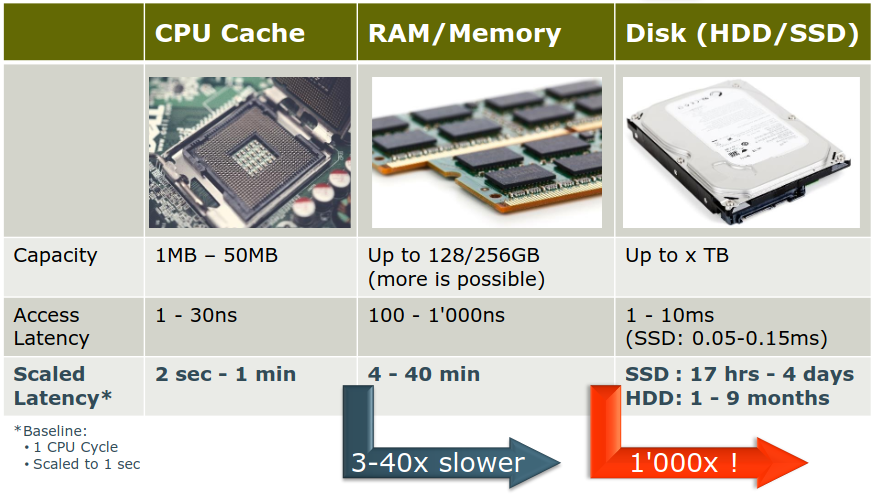

### Bottelnecks

Table joins can be bottlenecks. Especially without indexes, they need to process a lot of data and, thus, might heavily use I/O. For query performance, you can skip/avoid joins by using:

- denormalized table design
- materialized view

## Indexes

Do not just index each and every column in your tables (they must be updated with each insert, update and delete!). Create indexes that serve several different queries! When you load a huge amount of data, you might drop the indexes and recreate them after the import.

### Cluster Indexes

- Tables physically ordered by key
- The key(s) and the data of a row are stored together
- Only one clustered index per table

> Note: MySQL automatically clusters the table!

### Nonclustered / Secondary Index

- Additional data structure containing key(s)
- More than one index possible per table
- Data is separate from index


```sql
CREATE INDEX
    IDX_Person_Name
ON
    person (Name);
```

## Heap

- Table content unordered
- Data usually appended to the end
- Identifier necessary to access the row (additional 6 bytes per row!)
    - Row Identifier [RID] or
    - Tuple Identifier [TID]

::: {.callout-important}

Heap is not an index.

:::

## Query Optimizer

The Query Optimizer supports you to reduce the amount of data processed and also saved in the interim result sets.

### Algebraic Transformation

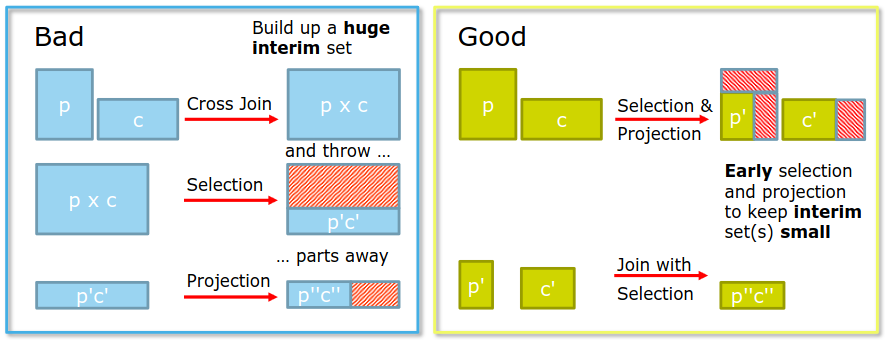

```sql
SELECT
    c.CourseNo,
    p.Name,
    p.Birthdate
FROM
    course AS c
INNER JOIN
    person AS p
ON
    c.ProfessorPersonId = p.PersonId
WHERE
    p.Name LIKE 'K%';
```

### Execution Plan

Most DBMS provide a textual or graphical execution plan to estimate query performance.

#### The "Good" Operators (Efficient)

- Unique Key Lookup: Searching or joining via a Primary Key or Unique Index. (Fastest).
- Non-Unique Key Lookup: Searching an indexed column that allows duplicate values.
- Index Range Scan: Fetching a subset of data using operators like >=, <, or BETWEEN ... AND.

#### The "Bad" Operators (Inefficient)

- Full Table Scan ("ALL"): MySQL reads every single row in the table from disk.
- Full Index Scan ("INDEX"): MySQL reads the entire index tree from top to bottom.

## Syntactical Query Optimization

### Functions on search columns

- Bad: `WHERE LEFT(b.Name, 2) = 'An';`
- Good: `WHERE b.Name LIKE 'An%';`

### SARGable queries

SARGable stands for Search Argument Able. A query is SARGable if the MySQL engine can take advantage of an existing index to speed up the execution. If a query is Non-SARGable, MySQL cannot use the index and is forced to resort to a slow Full Table Scan.

# Session 7: Database Visualization

## Value of Database Visualization

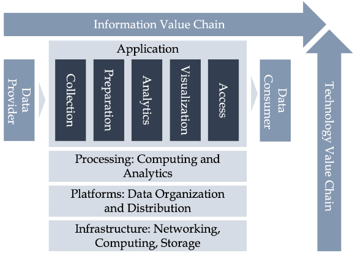
