# Lecture 01: Introduction

## Relevance of Data Quality

A key advance in data quality emerged in the 1920s through R. A. Fisher’s work in experimental design, which introduced randomization and replication to estimate error, bias, and precision.

## Definitions

### Data

Data are abstract representations of selected features of real-world entities, events, and concepts, expressed and understood through clearly definable conventions (Sebastian-Coleman, 2013).

### Data Quality

- Contextual data quality: The quality of data is defined by two related factors: how well it meets the expectations of data consumers (how well it is able to serve the purposes of its intended use).
- Intrinsic data quality: How well it represents the objects, events, and concepts it is created to represent.

## Data Management

### DQ as part of Data Management

Data Governance sits at the center (the hub) because it provides oversight, direction, policies, and coordination. Data quality is but one element of effective data management.

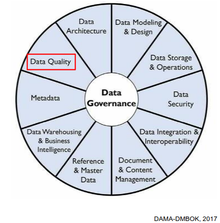

### Role of Data Quality Managers

- Develop a governed approach to make data fit for purpose based on data consumers requirements.
- Define standards, requirements, and specifications for data quality controls as part of the data lifecycle.
- Define and implement processes to measure, monitor, and report on data quality levels.
- Identify and advocate for opportunities to improve the quality of data, through process and system improvements.

## Data Quality Dimensions

- Correctness/accuracy: The data accurately describe the entity in question
- Completeness: No missing records/field values
- Conformity/validity: Correct types, value ranges, etc.
- Consistency: No contradictions between different data sets / tables

> Note: Breaking the issue down into dimensions helps to quantify issues.

::: {.callout-note}
Most sources agree that the concept of data quality has several dimensions. But they don't agree on what these dimensions are.
:::

# Lecutre 02: Data Quality Dimensions

In order to measure a broad concept such as data quality, it needs to be broken down into measurable, actionable dimensions. Each dimension captures one measurable aspect of data quality. Measuring data quality serves to analyze/understand/resolve or minimize data quality problems.

> Note: Some of the dimensions are objective/quantitative or subjective/qualitative.

## Classification of Dimensions

### Objective vs. subjective measurement

- Objective: Verifiable by rules, counts, constraints, timestamps, or comparisons. Independent of user perception.
- Subjective: Depends on human judgment, expectations, or context of use.

### Data value (intrinsic) vs. usage-dependent (contextual)

- Data value: Intrinsic quality of the dataset itself. Affects correctness, analytical validity, and downstream results even if usage is unknown. E.g. completeness, consistency
- Usage: Quality emerges only in interaction with users, systems, or tasks. Context-dependent.

## Popular Dimensions

### Quantitative and intrinsic dimensions

- Completeness: No missing records/field values
- Correctness/accuracy: The data accurately describe the entity in question
- Conformance/validity: Correct types, value ranges, etc.

### Quantitative and contextual dimension

- Consistency: No contradictions between different data sets / tables
- Currency: the data are up to date

#### Completeness

Completeness is the most fundamental dimension. It simply measures whether data are present or absent. Analysis may be limited to critical/mandatory attributes. Measurement:

- at the field level (per column)
- at the record level (how many rows have any missing fields)
- at the table level (how many records are missing)

> Note: The completeness can be calculated as a percentage at the field, record and table levels.

::: {.callout-note}
Not all missingness indicates a data quality problem. To record (and therefore measure) qualified missingness in a database, one can use special sentinel values (e.g., `-9999` for numeric attributes, `NA` for text attributes)
:::

#### Correctness/accuracy

It measures the extent to which data are the true representation of reality. Measurement:

- at the field
- at record level

#### Conformance / Validity

Conformity (or validity) means compliance of the data with a set of standards, e.g., in terms of:

- Type ("Name" is a string; "Number of children" is an integer)
- Range ("Contractual work hours" is between 0 and 50)
- Format ("Date" in ISO format YYYY-MM-DD, "Email" me{at}example.com)
- Value from a reference list ("CH", "DE", ...)

> Note: But even fully conformant data can be 100% inaccurate.

## Role of Representation

Besides conformance/validity, another prerequisite of correctness/accuracy
is correct representation.

::: {.callout-caution}
- **December 13, 1941** -> invalid
- **1941-13-12** -> valid entry, but wrong representation
- **1941-12-13** -> valid, correct representation correct/ accurate (provided the information is intrinsically accurate)
:::

## Role of Metadata

Metadata are data about data. Without metadata, it can be difficult to make sense of data. High quality metadata is important for representational effectiveness. Standard database metadata includes:

- Table/ column names and definitions
- Data types and domains of values
- Whether columns can have NULL values
- Rules regarding data relationships
- Cardinality (Number of unique values compared to the total rows, e.g. gender, boolean flags)

# Lecture 03: Exploratory Data Analysis

## Data Preparation

The process of manipulating data before analysis is referred to as data preparation. The meaning of the term data preparation depends on Point of view, Roles, Intended data use.

### Point of view

The meaning of data preparation varies depending on one's position in the hierarchy.

> Note: We take a statistical view and focus on the EXPLORE/TRANSFORM level.

### Role and intended data use

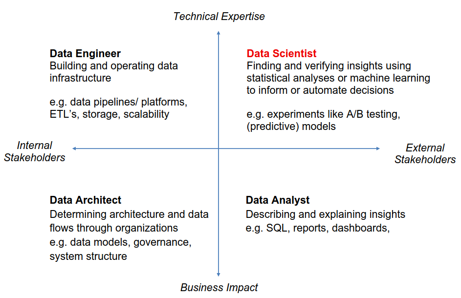

## From Data to Understanding

The process from data to understanding is often described to as a cycle

*"Data Wrangling is the ability to take a messy, unrefined source of data and wrangle it into something useful. It’s the art of using computer programming to extract raw data and creating clear and actionable bits of information for your analysis. Data wrangling is the entire front end of the analytic process and requires numerous tasks that can be categorized within the get, clean, and transform components.”* (Bradley Boehmke)

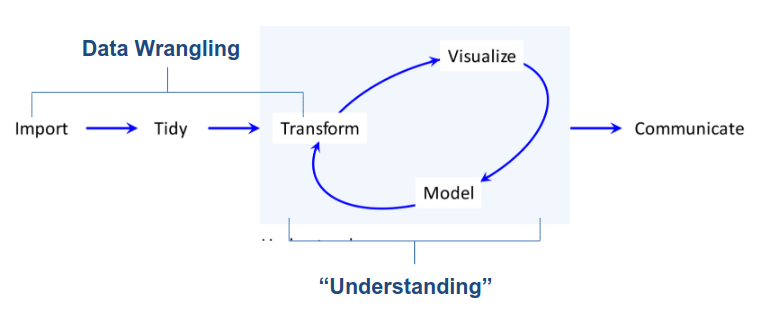

## Exploratory Data Analysis (EDA)

::: {.callout-tip}
Always plot your data first.
:::

### Raw Approach:

- Examine the data before applying a specific probability model
- Focus on descriptive analysis over hypothesis testing
- Methods of graphical data analysis

### Iterative cycle:

- Generate questions about your data.
- Search for answers by transforming, visualizing, and modeling your data.

### Steps in the EDA Process

#### Identify data attributes. Determine measurement scales

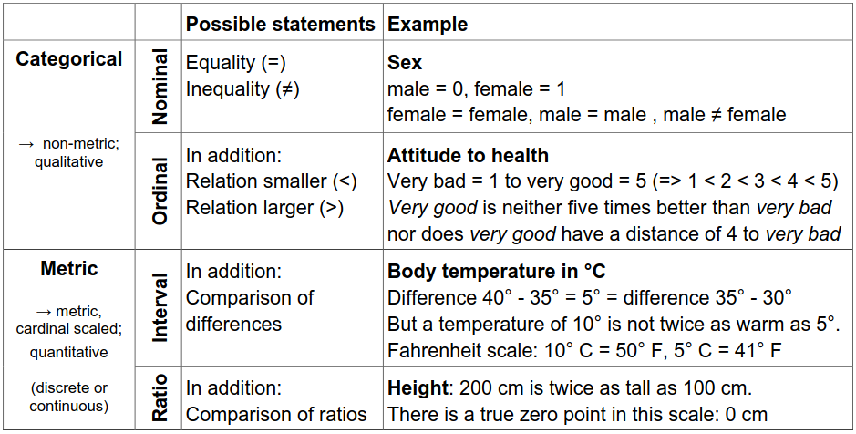

#### Univariate data analysis. Recognize basic properties of the data (e.g. boxplot)

Goal: Recognize basic properties of the data.

##### Description of central tendency:
- Arithmetic mean → Very sensitive to outliers
- Median → Splits data in half (25% smaller, 75% larger) → More robust to outliers than mean

##### Description of variability/ dispersion:
- Empirical variance
- Empirical standard deviation
- 1st quartile/ 25th percentile → 25% smaller, 75% larger.
- 3rd quartile/ 75th percentile → 75% smaller, 25% larger.
- Interquartile range (IQR) = 3rd quartile – 1st quartile → More robust than standard deviation


#### Bivariate & Multivariate data analysis. Recognize interactions in the data

Goal: Using bivariate & multivariate data analysis to recognize interactions in the data by using Plots and hypothesis tests.

Typical graphical procedures:
- Scatterplot
- Mosaic Plot

Typical tests:
- Pearson Chi-Square test

#### Following EDA steps

- Detect aberrant & missing values. Analysis & adjustment
- Outlier detection. Analysis & cleaning
- Create derived variables (index, etc.) & Variable transformation

# Lecture 04: Missing Values

## Why do we care about missing data?

Naively, one might think that missing data just means there is less data to analyze, so long as there are enough data to begin with. Unfortunately, this is only true in rare circumstances. In many cases, missing data may actually bias the results (give systematically wrong answers).

> Note: Missing data is the rule, not the exception.

## Reasons for missing data

### At the source

- Survey respondents refuse to answer certain questions
- Answers are invalid or cannot be decoded – for example, in paper questionnaires.
- In longitudinal studies, parts of the sample do not participate at all measurement time points
- Sensor failure


### Causes during data processing

- typing errors during coding
- Reading errors in digitalizing (for example, scanning of paper questionnaires)

> Note: The more technical reasons are often the most benign, because they may occur randomly and therefore don’t lead to bias.

## Forms of non-response

- Unit non-response: subjects refuse to participate or are systematically unreachable
- Item non-response: subjects refuse to answer specific questions

### Forms of item non-response (Little and Rubin, 2020)

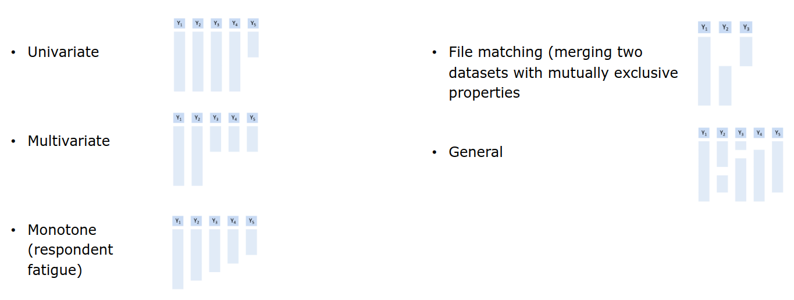

## Missing data mechanism

The missing data mechanism describes the underlying process that led to the missing data. It is crucial for determining which methods are adequate for dealing with the problem, if any.

### Missing Completely at Random (MCAR)

The probability of a value being missing does not depend on any observed or missing data. I.e., missing values are completely randomly distributed across all cases (persons, etc.) Cases with missing values do not differ systematically from cases without missing values.

### Missing at Random (MAR)

The probability of a value being missing may depend on observed data, but not on missing data. The occurrence of a missing value occurs conditionally at random and can be explained by the values in other variables. Cases with missing values may differ systematically from cases without missing values, but in a way that can be modeled.

### Missing not at Random (MNAR)

The probability of a value being missing depends on missing data. Values are systematically missing but no information is available to model their absence. There is no adequate statistical procedure to avoid bias.

## Dealing with Missing Data

### Listwise deletion / Complete case analysis

Delete all rows that have a missing value. Advantage: simple. Disadvantages: Wasteful. Imagine a dataset with 10 attributes, each with 10% missings. Then $P\text{(complete row)} = 0.9^{10} = 35\%$.

### Pairwise deletion / Complete case analysis

Delete all rows that have a missing value. Advantage: simple & less wasteful. Results in different sample sizes for different model.

## Single Imputation

Generally, imputation refers to the practice of replacing missing values with values constructed in some way. Specifically, single imputation means that each missing value is replaced by one value.

### Mean Imputation

NAs are replaced by the mean of each variable. Advantages: Simple. Disadvantages: Not unbiased for regression or correlation.

### Regression Imputation

For each target variable to be imputed, run a regression on some or all other variables and use it to predict the missing values. Advantages: Under MCAR and MAR, unbiased for regression. Disadvantages: Not unbiased for correlation.

### Stochastic Imputation

For each target variable to be imputed, randomly draw a value from some distribution. Advantages: Under MCAR and MAR, unbiased even for correlation. Disadvantages: Standard errors too small.

### Overview of Imputation Methods

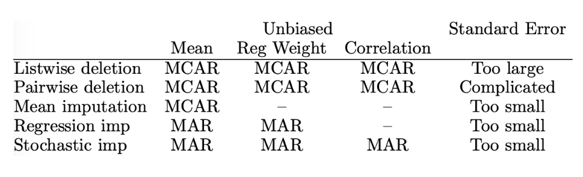

## Multiple Imputation

In multiple imputation, instead of applying stochastic imputation once, it is applied m times (e.g., m=5). This creates 5 complete datasets. The data sets are analyzed separately, and the results are combined (pooled) according to certain rules. Advantages: Only method that can yield correct standard errors, even under MAR. Disadvantages: Still cannot handle MNAR (nothing can, only more data).

> Note:  In ML, we're often not interested in standard errors.

## Little’s MCAR Test

It essentially tests if the means / covariances are the same under each missingness pattern.

- $H_0$: The data are MCAR
- $H_A$: They are not

::: {.callout-important}
The test has low power: even if the test doesn't reject, MCAR is not guaranteed.
:::

# Lecture 05: Univariate Outlier Detection

Anomaly detection generally refers to the process of automatically detecting events or behaviors which deviate from those considered normal. Outlier detection aims at identifying unusual objects in a database, i.e., different than the majority of the data and therefore suspicious resulting from a contamination, error, or fraud.

## Outliers

- Data error (e.g., during data entry or transmission) -> remove to avoid bias, or use robust methods (e.g., median in place of mean).
- Not an error: in this case outliers may be the most interesting data points -> keep. Robust methods can still be useful depending on context. It may even be preferable to model the outliers explicitly (e.g., as a separate category)

## Paradigms

### Supervised Outlier Detection

The data set is fully labeled; each datapoint is labeled as either normal or abnormal. OD problem boils down to classification (with pronounced class imbalance). Rare, as labeling (by a domain expert) is expensive.

## Semi-Supervised Outlier Detection

Only (or mostly) normal observations are labeled. Goal to to learn the distribution from the normal observations; outliers will be detected by deviating from that distribution.

### Unsupervised Outlier Detection

The data set is unlabeled; it is not known if an observation is normal or abnormal. OD tries to identify outliers based on their dissimilarity to ”typical” observations. 

> Note: Much more common scenario.

### Parametric

A specific distribution (e.g., Gaussian) is assumed and only its parameters (e.g., mean and variance) are
estimated from the data.

- Advantage: efficient (less data needed) if parametric assumption is correct.
- Disadvantage: the assumption might be wrong.

### Non-parametric

The entire distribution is learned from the data.

- Advantage: flexible; no distributional assumption needed.
- Disadvantage: needs more data.


## Noise vs. Anomalies

Noise is a random or natural variability of a process. Example: Thermal noise of a measuring sensor. Typically does not produce unusual values. Anomalies are data points that significantly deviate from the expected behavior of the majority of the data.

## Types of Outliers

- Global: A data point is considered a global outlier if it significantly deviates from the entire rest of the dataset.
- Local: A local outlier is a value that is unusual only when compared to its immediate neighborhood, even if it looks normal in a global context.
- Cluster: These are groups of data points that collectively deviate from the main pattern of the data, forming their own anomalous structure.
- Micro-Cluster: A micro-cluster consists of a very small, dense group of points that are isolated from the main clusters and treated as a collective anomaly.

## Univariate Outlier Detection

### Tukey’s Criterion

A value is considered an outlier if the value is more than $1.5 \times IQR$ outside of the Boxplot.

### Percentile Method

he percentile method simply treats the most extreme observations on either side as (potential) outliers.

$$
100 \times \dfrac{\alpha}{2}\%
$$

::: {.callout-important}
Note: this will, by definition, mark $\alpha$% of the data as outliers, regardless of the distribution. 
:::

### z-Score Method

The z-score methods treats any observation with abs $|z_i| > k$ as an outlier, for some value of $k$.

$$
z_i = \dfrac{x_i - \bar{x}}{S_x}
$$

Below is a comparison showing the percentage flagged as outliers by the z-score method under normality and in
the worst case.

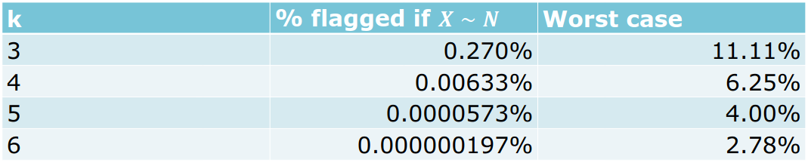

### Grubbs’ Test

Grubbs' test is a statistical method used to detect a single outlier that follows an approximately normal distribution. The test identifies the largest absolute deviation from the sample mean and determines if that value is statistically significant compared to the rest of the data.

Hypotheses:

- $H_0$: The observation was drawn from the same distribution (**not an outlier**)
- $H_A$: The observation was drawn from a different distribution (**outlier**)

$$
G = \max|z_i| = \dfrac{\max|x_i - \bar{x}|}{S_x}
$$

::: {.callout-caution}
Grubbs' test can suffer from masking, where the presence of multiple outliers "hides" each other, making the test fail to detect any of them.
:::

### Rosner’s test

Rosner’s test can test a pre-specified number 𝑘 of extreme observations for whether they are outliers. It is a direct generalization of Grubbs’ test. It works by successively removing observations and applying Grubbs’ test again, adjusting the critical value to control Type I error.

# Lecture 06: Multivariate Outlier Detection

Unlike univariate methods, multivariate approaches identify outliers based on deviations from the multi-dimensional distribution rather than extreme values in isolated attributes.

## Notation

We need two subscripts to label data:

- $i \in {1, \dots, N}$: for labeling observations.
- $i \in {1, \dots, N}$: for labeling attributes.

::: {.callout}
We’ll use $x_i$ to refer to the entire vector of attributes corresponding to the $𝑖$th observations.

$$
x_2 = [1, 2, 3]^T
$$
:::

## Mahalanobis Distance

The Mahalanobis Distance is a sophisticated measure of the distance between a point and a distribution. Unlike the standard Euclidean distance, it accounts for the correlations between variables and the scale of the data.

$$
\tilde{D}_i^2 = \sum_{j=1}^{p} z_{ij}^2
$$

### Cutoff Value

If the data follow a multivariate normal distribution, then the squared Mahalanobis distance $D_i^2 = (x_i - \bar{x})^T \Sigma^{-1} (x_i - \bar{x})$, is approximately $x^2$ distributed with $p$ degrees of freedom.

> Note: $p$ equals the number of attributes.

This means that we can use the corresponding critical value as a cutoff to identify outliers. The Mahalanobis distance uses the ellipsoids as cutoffs to detect outliers.

$k$ represents how many standard deviations away from the center you are looking


## Introduction to Clustering

Clustering is an unsupervised machine learning technique. The Goal is to find structure in the data. The differences between the clusters are as large as possible, but the datapoints within a cluster are as similar as possible.

::: {.callout-important}
Not necessarily designed for outlier detection but can be used for it.
:::

### Euclidean Distance

Euclidean distance is the most common metric used to measure the straight-line distance between two points in a multi-dimensional space. In clustering, it serves as the "ruler" used to determine how similar or different data points are.

$$
d(\mathbf{x}_1, \mathbf{x}_2) = \sqrt{\sum_{j=1}^{p} (x_{1j} - x_{2j})^2}
$$

### K-Means

K-means is probably the best-known clustering algorithm.

> Note: $k$ = number of clusters (to be specified a priori)

Given $k$ and $a$ set of points ($x_1, \dots, x_N$), each of which is a p-dimensional vector the objective is to find $k$ so-called centroids ($\mu_1, \dots, \mu_k$) (also of dimension $p$) such that the average squared Euclidean distance between each point and its nearest centroid is minimal.

$$
R(\mu_1, \dots, \mu_k) = \frac{1}{N} \sum_{i=1}^{n} \min_{j \in \{1, \dots, k\}} d(\mathbf{x}_i, \mu_j)^2
$$

#### Lloyd’s Heuristic

Lloyd’s heuristic is what most people mean when they talk about the k-means algorithm.

Starting point: Choose k and k random datapoints as the initial centroid $\mu_i$. Iterate the following two steps until convergence (local optimum):

1. Assign each datapoint to the closest centroid $\mu_i$.
2. Compute new centroids $\mu_i$ as the mean of all datapoints assigned to it.

In practice, the algorithm is used multiple times to compare results.

::: {.callout-tip}
It is recommended to scale each variable to have standard deviation 1 (as in z-scores)
:::

#### How many clusters?

One way to determine the number of clusters is a scree plot. The scree plot runs k-means for different choices of $k$ and plots the objective function $R(\mu_1, \dots, \mu_k)$ against $k$.

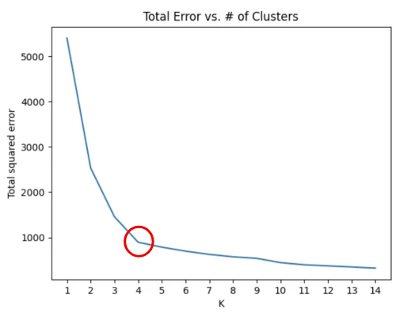

### Outlier Detection using Clustering

Barai & Dey (2017) suggest a very simple way to use clustering for outlier detection: Simply consider the smallest cluster as a outlier.

#### Silhouette Plot

Silhouette coefficients of an observation measure the average distance from its own cluster compared to the average difference of the nearest cluster scaled to the interval $[-1, 1]$. A value close to 1 indicates an inlier that is well-separated from other clusters. Negative values may signal local outliers. An average silhouette coefficient of 0.5 signals good clustering (0.7 excellent)

::: {.callout-caution}
A small cluster with a very high average silhouette coefficient may indicate a cluster of outliers (well separated from everything else).
:::

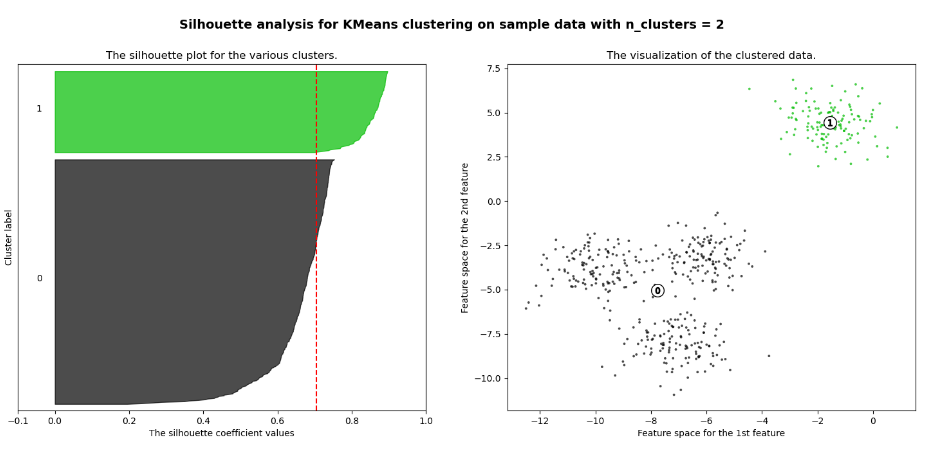

# Lecture 07: Multivariate Outlier Detection - Other Algorithms

## RANSAC

**Ran**dom **Sa**mple **C**onsensus is an iterative procedure for estimating parameters of a mathematical model from a set of observed data containing outliers. The goal is to ensure that outliers do not affect the estimation of the model. A basic assumption is that the data consists of:

- inliers: Data whose distribution can be explained by model parameters.
- outliers: Data that do not fit this model.

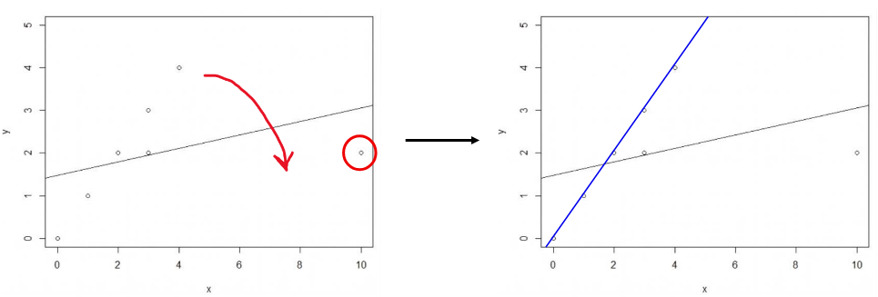

### Procedure

1. Randomly select as many points as necessary to calculate the parameters of the model. Call this subset the hypothetical inliers ($n$)
2. Fit the model to the set of hypothetical inliers.
3. Determine the subset of points whose distance from the model is smaller than a certain threshold. This subset is called the consensus set ($t$)
4.  The estimated model is good if enough data points have been classified as part of the consensus set (i.e., hypothetical inliers are probably inliers) ($d$)

In that case, re-estimate the model using all members of this consensus set.

5. Repeat steps 1 through 5 several times and return the best-found model.

```r
ransac <- function(data, n, k, t, d) {
    iterations <- 0
    :
    while (iterations < k) {
        maybeinliers <- sample(nrow(data), n)
        maybemodel <- lm(y ~ x, data = data, subset = maybeinliers)
    :
    } bestfit
}
```

## DBSCAN

DBSCAN is a density-based clustering algorithm. It groups together points that are packed closely together (high-density regions) and marks points in low-density regions as outliers or noise.

### Key Parameters

- Epsilon ($\epsilon$): The maximum distance between two samples for one to be considered as in the neighborhood of the other. Think of it as the "search radius."
- MinPts: The minimum number of points required to form a dense region (a cluster).

### Points Classification

- **Core points**: Contain at least MinPts data points.
- **Border points**: Contains less than MinPts points but contains at least one core point within a radius $\epsilon$.
- **Noise points**: Are neither core points nor border points.

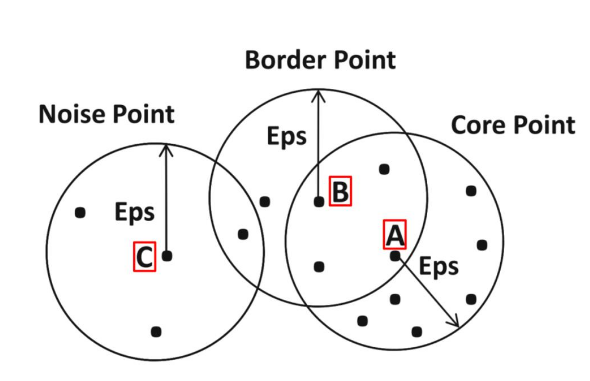


```r
kNNdistplot(data, k = 4)
```

> Note: The kNNdist plot sorts all data points by their k-nearest neighbor distance.

# Lecture 08: Data quality in the context of DoE and ML

## The End of Theory

The new availability of huge amounts of data, along with the statistical tools to crunch these
numbers, offers a whole new way of understanding the world. Correlation supersedes causation,
and science can advance even without coherent models, unified theories, or really any
mechanistic explanation at all.

### Pro

- Reduced dependence on explicit a priori theories.
- Large data quantities may cover entire domains and provide comprehensive solutions given sufficient, representative, and well-measured data.
- ML and AI leverage large datasets to extract patterns and make predictions in high-dimensional settings. Scalable computation enables detection of complex, nonlinear relationships.
- Automated feature learning reduces reliance on manual, theory-driven variable construction.

### Contra

- Correlation is not causation.
- Large data quantities are generated within specific contexts and constraints:
    - Aim and purpose, sampling and selection mechanisms
    - Measurement systems and technology, platform effects
    - Regulatory environment
- Data cannot be interpreted independently of their generation process and context.
- There is no unbiased, value-free data analysis; assumptions enter from collection to modeling
- Measurement error, noise and bias persist; vulnerability to distribution shifts
- Lack of experimental design reduces sample efficiency

## Transforming Data into Content

In the context of processing and using data, the DIKW pyramid is often mentioned.

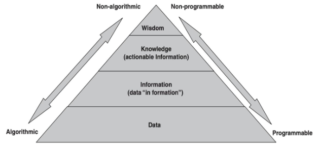


::: {.callout-caution}

The pyramid assumes that data simply exists. But data has to be created.

:::


## Data quality in the context of DoE and ML

DoE and ML approaches provide complementary methodologies for quality improvement. DoE is focused on identifying quality-relevant process factors, is human‑centered and typically uses "small", designed data and becomes more effective with deeper prior knowledge about the process. ML is focused on identifying patterns/features in large, often unstructured data, is data‑/model‑centered and often deals with "big", observational data and is more effective with higher data quality and a larger amount of training data.

# Lecture 09: Quality Criteria of Studies

## Validity

- Internal validity: The extent to which a study can confidently establish a cause-and-effect relationship between the independent variable (treatment/manipulation) and the dependent variable (outcome).
- External Validity: The extent to which the results of a study can be generalized to other people, settings, times,
or situations outside the specific study conditions.
- Trade-off: Lab experiments → high internal validity, often low external validity. Real-world studies → higher
external validity, often lower internal validity.

## Checklist

- Is there a clear statement defining the objective and goal of the work?
- Is there an adequate description justifying the choice of the research method?
- Is the research method appropriate to address the defined goal?
- Is the applied evaluation feasible to achieve the desired results?
- Are the findings precisely and coherently reported?
- Is the value of the work evident?

> Note: [https://dl.acm.org/doi/10.1145/3356901](Shakeel et. al. (2020))

## Reproducibility vs. Replicability

- Reproducibility: Obtaining consistent results using the same data (original authors’ artefacts), computational steps, methods, and code.
- Replicability: Obtaining consistent results across studies aimed at answering the same scientific question, each of which has obtained its own data.
- Repeatability: Reproducibility by the same team, rather than someone else.

### The “Four Horsemen of Irreproducability”

- Publication bias: Journals selectively publish results that are statistically significant or otherwise attractive. There is no “Journal of Failed Research”.
- p-hacking: Researchers torture the data with different methods until the data confess (a p-value below 5% is found), and then report only that analysis. This multiple testing inflates Type I error (probability of falsely rejecting the null). A pileup of p-values just below the arbitrary 5% threshold in published work has been demonstrated.
- HARKing (Hypothesizing After the Results are Known): Researchers run the study, look at the data, then write the paper as if they had predicted the "significant" findings all along (post-hoc hypotheses presented as a priori). Famous paper showing the dangers from economics: “I Just Ran Two Million Regressions”.
- Low statistical power: Researchers use sample sizes too small to reliably detect the effects they're looking for (or
to rule them out). Leads to noisy, inconsistent results, high rates of false negatives, and exaggerated effect sizes
when something does pop up by chance.

### Measuring Replication Success

- Repeated significance: This simply asks whether an effect that was significant in the original study continues to be significant in the replication attempt.
- Compatibility of effect size
    - Is the effect size of the replication attempt contained in the prediction interval of the original study? Note: prediction intervals are similar to confidence intervals, but they bracket not the mean, but an individual observation (which is noisy, so the interval is wider.)
    - Q-Test: this is a formal test of the compatibility of effect sizes. The null is that the effects are compatible; reject if p-value < 0.05. This turns out to be equivalent to the previous criterion.

# Lecture 10: Data Quality Aspects in Large Datasets

## The 5 V's of Big Data

- Volume: The massive scale of data — think terabytes, petabytes, or exabytes generated from sources like social media, sensors (IoT), transactions, etc.
- Velocity: The high speed at which data is generated, collected, and needs to be processed (e.g., real-time streams from IoT devices or stock markets, X/Twitter posts, etc.).
- Variety: The different types and formats of data — structured (databases), semi-structured (JSON/XML documents), and unstructured (text, images, videos, emails).
- Later frameworks identify other Vs. Most common are the 5 Vs, which include in addition
- Veracity (or lack thereof): The quality, accuracy, and trustworthiness of the data. Big data often includes noise, biases, inconsistencies, or incompleteness, so cleaning and validation are crucial.
- Value: The most important one — the actual business or actionable insights you can extract. Raw data has no worth unless it drives decisions, predictions, or innovation

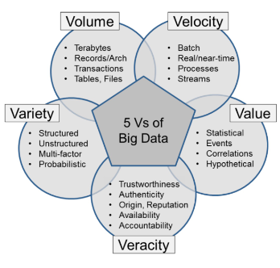

### Big Data-Specific Challenges

- Volume: Scale makes manual inspection impossible; issues hide in petabytes.
- Velocity: Real-time streams leave little time for thorough validation.
- Variety: Mixing structured, unstructured (text, images, video), and semi-structured data from diverse sources (IoT, social media, legacy systems) creates format/schema mismatches and integration headaches.
- Veracity issues: Noisy, biased, or uncertain data (e.g., fake social media posts, sensor errors, human entry mistakes), unclear lineage.
- Distributed systems: Data silos, replication across clouds/clusters, and evolving schemas lead to
inconsistencies,

## Big Data Quality

- Completeness: no missing records/field values
- Correctness/accuracy: the data accurately describe the entity in question
- Conformity/validity: correct types, value ranges, etc.
- Consistency: no contradictions between different data sets / tables
- Currency: the data are up to date

## Scale Up vs. Scale Out

- Scale up/Vertical scaling: make a single machine more powerful (more CPUs, RAM, disk space, …)
- Scale out/Horizontal scaling: add more machines (nodes) to a cluster

Modern hyperscalers almost always scale out; scaling up hits practical limits, and scaling out is much cheaper because it uses commodity hardware.

### CAP Theorem

The CAP theorem holds that any distributed data store can provide at most two of the following three guarantees:

- Consistency: all clients see the same data at the same time, no matter which node they connect to
- Availability: Every request received by a non-failing node in the system results in a response
- Partition tolerance: the system continues to operate despite an arbitrary number of messages being dropped (or delayed) by the network between nodes.


::: {.callout-note}

Intuition: When a network partition failure happens, it must be decided whether to do one of the following:

- cancel the operation and thus decrease the availability but ensure consistency
- proceed with the operation and thus provide availability but risk inconsistency.

:::

## The BASE Model

Big data systems often prioritize availability over consistency.

- Basically Available: The system guarantees responsiveness and uptime, even during node failures or network partitions
- Soft state: Data consistency is not guaranteed at all times; the system state may change over time without input due to data replication and synchronization.
- Eventual Consistency: The system will become consistent eventually, once it stops receiving input, allowing nodes to synchronize data asynchronously

> Note: The BASE model is to be contrasted with the ACID model for traditional database.

## Best Practices

- Shift left and automate: Embed quality checks early in pipelines (ingestion, transformation) to prevent inaccurate data from entering the system. Use tools to check for schemas, data types, and required fields.
- Data Observability and Monitoring: Rather than static checks, adopt automated, real-time monitoring to detect anomalies (e.g., schema changes, unexpected null values, distribution drifts) as they occur. Set thresholds (e.g., <1% nulls for key fields) and score overall quality.
- Governance & Culture: Assign data owners, define SLAs for quality, maintain clear definitions (metadata), and train teams.
- Utilize AI for Data Cleansing & Anomaly Detection: Use machine learning models to identify complex patterns, inconsistencies, and outliers that automated rule-based systems might miss.

## QQ-Plot

A Quantile-Quantile (Q-Q) Plot is a visual tool used in statistics to assess if a dataset follows a specific theoretical distribution (most commonly, a normal distribution).It plots the quantiles of your sample data against the quantiles of the theoretical distribution. If the data fits the chosen distribution, the points will fall roughly along a straight diagonal line ($y = x$).

```r
set.seed(42)
sample_data <- rnorm(100, mean = 50, sd = 10)

qqnorm(sample_data, main = "Normal Q-Q Plot", 
       xlab = "Theoretical Quantiles", ylab = "Sample Quantiles",
       col = "blue", pch = 16)
qqline(sample_data, col = "red", lwd = 2)
```

### Interpretaiton

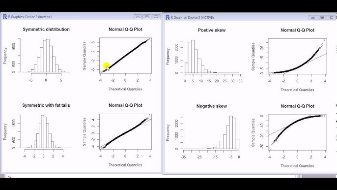
